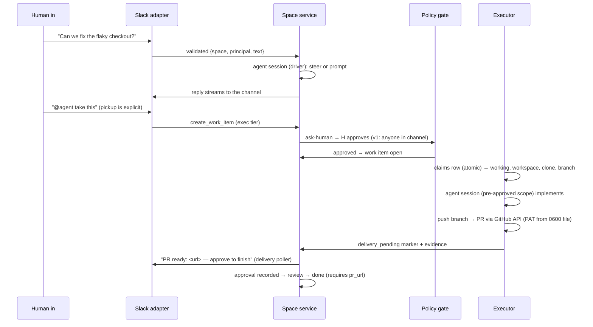

# bottega

Team agents that live in your chat. Slack spaces where people and agents
work together: work items get picked up, implemented in isolated workspaces,
and delivered as pull requests — with every action policy-gated and audited.

Per-org self-hosted: one `docker compose` stack (server, executor,
auth-broker, auth-gateway, iron-proxy) plus a shared `data/` volume for
SQLite state, sessions, and git credentials. Built with Bun + TypeScript on
the [OMP](https://oh-my-pi.dev) agent core; the egress firewall is
[iron-proxy](https://github.com/ironsh/iron-proxy) (Go, used unmodified).

---

## Architecture

### The model: three primitives

1. **Spaces** — a space is a durable shared timeline (messages + work items +
   participants) with its own policy. A Slack channel is a space
   (`slack:<channel_id>`; threads share the channel space in v1). The space,
   not the agent, owns the conversation: anyone can talk, steer, interrupt,
   or approve at any time, and the timeline just keeps appending.
2. **Work items** — the only thing an agent does autonomously. Each runs as
   a scoped agent session with its own workspace, tool allowlist, policy
   context, and audit trail, so parallel work is safe by construction; only
   the conversation serializes in the space.
3. **Actions & policy** — every agent action crosses one policy gate:
   `tier × space policy × roles → allow | deny | ask-human`. Unknown action →
   deny. Policy error → deny. Fail closed is the default.

### Components

```
 Slack (Socket Mode — no public ports)
        │  adapter validates & normalizes (the ONLY ingress)
        ▼
┌─────────────────────────── server (Bun) ───────────────────────────┐
│  slack.ts          Bolt adapter: message → space, replies, buttons  │
│  space-service.ts  one AgentSessionDriver per ACTIVE space          │
│  agent-driver.ts   AgentDriver abstraction (agents are pluggable)   │
│  acp-driver.ts     ACP driver: spawns any ACP agent (e.g. omp acp)  │
│  policy/*          action gate + approval router + audit writer     │
│  delivery-poller.ts  posts "PR ready" announcements to the channel  │
│  index.ts          wiring: store + adapter + driver + extensions    │
└───────────────────────────────────┬──────────────────────────────────┘
                                    │ SQLite (data/bottega.db, WAL)
┌─────────────────────────── executor (Bun, container) ──────────────┐
│  polls work_items (atomic claim) → workspace per item → agent       │
│  session (AgentDriver, pre-approved policy scope) → branch → PR     │
└───────────────────────────────────┬──────────────────────────────────┘
                                    │ all outbound traffic
                        ┌───────────▼───────────┐
                        │  iron-proxy sidecar   │  default-deny allowlist,
                        │  auth-broker/gateway  │  LLM-judge, DNS sinkhole,
                        └───────────────────────┘  secrets at the boundary
```

### Agent driver abstraction (agents are pluggable)

The agent is **not** hardwired to OMP. Everything that talks to an agent —
the space service, the executor — depends only on the `AgentDriver` /
`AgentSessionDriver` interfaces in `src/server/drivers/agent-driver.ts`:

```ts
interface AgentSessionDriver {
  prompt(text, opts?: { streamingBehavior?: "steer" | "followUp" }): Promise<void>;
  abort(): Promise<void>;
  isStreaming(): boolean;
  on(event: "message" | "turn_start" | "turn_end" | "error", cb): () => void;
  dispose(): Promise<void>;
}
interface AgentDriver {
  createSession({ spaceId, transcriptDir, onOutput, cwd?, allowTools? }): Promise<AgentSessionDriver>;
}
```

- **`createOmpSdkDriver`** (default) wraps the OMP SDK. It owns all
  OMP-specific wiring: the space-agent tool allowlist (conversation/read-only
  tools + `task` + `create_work_item`/`work_item_cancel`; **no** bash/write
  on the space agent), file-backed transcripts
  (`data/sessions/<space-id>.jsonl`), a private agent registry per session,
  and the policy + audit extensions.
- **`createAcpDriver`** spawns any ACP-speaking agent (default `omp acp`)
  over stdio JSON-RPC 2.0 (newline-delimited, per the ACP v1 spec). This is
  how a non-OMP agent plugs in later without touching bottega code. OMP is
  the first engine, not a dependency.
- ACP permission requests are the future policy surface for non-OMP agents
  (see roadmap); today the OMP driver enforces policy in-process via
  extensions.

### Policy & approvals

`src/policy/` implements the gate:

1. **Tier** comes from the tool declaration (read / write / exec); unknown
   tools are treated as exec, and unknown *names* always deny.
2. **Policy** = org floor (`config.yml`, fail-closed when absent: everything
   denies) + space overlay (`spaces.policy_json`, can only tighten). Strict
   YAML-subset parsing; any structural error fails the policy closed.
3. **Decision**: deny wins; `prompt` and `exec` tier → `ask-human`;
   read/write + allow → allow. Exec never fails open.
4. **ask-human** routes through an `ApprovalRouter` — the interface ships
   with a `DenyRouter` (headless contexts); the Slack button router is a
   follow-up. Timeout (default 5 min) → deny.
5. **Every decision** is audited (`policy.decision` with tool/tier/decision/
   reason; args redacted).

Executor sessions run with `preApproved: true` policy scope: the work item's
pickup approval (the human-approved `create_work_item` call in the channel)
**is** the authorization. Allowlisted exec tools are then permitted inside
the workspace, while unknown tools still deny and explicit deny/prompt
policies are never bypassed.

### Data flow: "issue shared in Slack gets implemented"



### Safety model

| Threat surface | Control |
|---|---|
| Untrusted ingress | Adapters validate every event; only adapters mint messages |
| Credential exposure | Provider keys in auth-broker vault; Slack tokens only in server `.env`; git PAT only in a mode-0600 file on the data volume; OMP secret obfuscation (`secrets.enabled`) |
| Malicious repo content | Work items run in the executor container in disposable workspaces; server never mounts repo paths |
| Exfiltration / rogue egress | All outbound traffic through iron-proxy: default-deny allowlist (NEAR.ai model endpoints), LLM-judge for unmatched, DNS sinkhole (containers resolve only through the proxy) |
| Unauthorized side effects | Policy gate on every tool call; exec prompts to humans; unknown → deny |
| Data loss / tampering | Append-only audit (SQLite triggers reject UPDATE/DELETE), transcripts retained, never deleted |
| Failure | Fail closed: parse errors, policy errors, model outages, missing tokens → deny or block with evidence |

### Persistence & audit

One SQLite file (`bun:sqlite`, WAL, busy_timeout for the server+executor
two-process share), migrated idempotently at boot:

- `spaces` — space registry + per-space policy overlay.
- `work_items` — the queue and the state machine: `open → claimed → working
  → review → done | blocked | aborted`, with a legal-move map enforced in the
  store (single choke point) and obligations: `done` requires a `pr_url`,
  `blocked` requires evidence, `review` requires a recorded approval. Stale
  rows (`claimed`/`working` past a TTL) are recovered to `blocked` with
  evidence on boot.
- `audit` — append-only; UPDATE/DELETE rejected by triggers. Every policy
  decision, approval, tool call (redacted), and work-item transition is a
  row. Payloads are redacted (secret-shaped values → `[REDACTED]`) and capped
  at 4 KB before write.

The space timeline itself is the OMP session file (`.jsonl` under
`data/sessions/`) — durable by construction, never deleted.

### Multiplayer & concurrency

- Many humans + one space agent: prompts during a stream **steer** (or queue
  as follow-ups); anyone can interrupt (`abort`).
- Idle spaces dispose their session (default 30 min) and cold-start on the
  next message — disposal is cache eviction, never data loss.
- Work items are independent sessions: parallel work is isolated by design.
- One process, many sessions: each session gets a private agent registry
  (OMP SDK requirement for concurrent top-level sessions).

---

## Repository layout

```
src/
  server/           index.ts (composition root)
  server/adapters/  slack.ts
  server/drivers/   agent-driver.ts, acp-driver.ts
  server/services/  space-service.ts, delivery-poller.ts
  policy/           config.ts, extension.ts, approval-router.ts, audit.ts
  store/            db.ts, schema.sql
  tools/            work-items.ts (create_work_item, work_item_cancel)
  executor.ts       containerized work-item runner (claim → PR)
  egress/           iron-proxy config + compose wiring
  secrets/          broker/gateway wiring
config/
  egress.yml        iron-proxy allowlist + judge policy
  omp/              config.yml (secrets.enabled), secrets.yml, models.yml
Dockerfile          single image (server + executor entrypoints), bun user
docker-compose.yml  server, executor (profile), auth-broker, auth-gateway, iron-proxy
slack-app-manifest.yml
scripts/smoke.sh    local checks + manual checklist
```

## Deployment

### Prerequisites

- Docker with Compose v2 (`docker compose version`)
- A Slack workspace where you can create apps
- A GitHub org/repo the bot may push branches and open PRs to
- Bun 1.3+ only for local development (`bun check`, `bun test`)

### 1. Create the Slack app

`slack-app-manifest.yml` in this repo declares the app (Socket Mode, bot
scopes, event subscriptions).

1. Open <https://api.slack.com/apps> → **Create New App** → **From an app
   manifest** → paste the contents of `slack-app-manifest.yml` → **Create**.
2. **Install to Workspace** and copy the **Bot User OAuth Token**
   (`xoxb-...`) — that is `SLACK_BOT_TOKEN`.
3. **App-Level Tokens** → **Generate Token** with the `connections:write`
   scope and copy it (`xapp-...`) — that is `SLACK_APP_TOKEN`. Socket Mode
   needs it; no request URL is required.

### 2. Set up `.env`

Copy `.env.example` to `.env` and fill in:

| Variable | What it is | How to get it |
| --- | --- | --- |
| `SLACK_APP_TOKEN` | App-level token | Slack app dashboard (step 1.3) |
| `SLACK_BOT_TOKEN` | Bot user OAuth token | Slack app dashboard (step 1.2) |
| `NEAR_API_KEY` | Model provider key | Referenced by `config/omp/models.yml`; resolved by the SDK inside the server, never in agent env |
| `OMP_AUTH_BROKER_URL` | Broker address | Prefilled for compose |
| `OMP_AUTH_BROKER_TOKEN` | Broker bearer token | Generated at broker first boot — copy from the data volume once (step 3) |
| `GITHUB_PAT` | Git credential | Install into the volume file, see step 3; never in env |
| `BOTTEGA_IMAGE_TAG` | Image tag to run | `local` by default; pin a build sha for rollback (step 5) |

### 3. First boot

```bash
docker compose --profile executor up -d --build
```

First boot generates the broker's bearer token into the data volume. Copy
it into `.env` once and restart:

```bash
docker compose exec auth-broker cat /data/.omp/auth-broker.token
# -> paste into OMP_AUTH_BROKER_TOKEN in .env
docker compose up -d
```

Install the git PAT as a file on the data volume (mode 0600, never env):

```bash
mkdir -p data/secrets
install -m 0600 /path/to/your-pat data/secrets/github-pat
```

> The executor and server share one image (`bottega:${BOTTEGA_IMAGE_TAG}`,
> built from the repo root) and differ only in entrypoint. The executor runs
> only when the `executor` profile is enabled, as above. To run without the
> executor, drop `--profile executor`.

### First-run checklist

1. `docker compose logs -f server` — no errors, bot connects via Socket Mode.
2. Invite the bot into a channel and @mention it — it should reply (the
   space agent answers in-channel).
3. Create a test work item (the `create_work_item` tool) — the executor
   claims it (`docker compose logs -f executor`), implements it in a
   workspace, opens a PR, and the server posts
   `PR ready: <url> — approve to finish` in the channel.
4. Restart persistence: `docker compose down && up` — spaces, work items,
   and the audit trail survive (they live on the `data` volume).

### Backup & rollback

- **Backup** — everything that matters lives on the `data` volume (SQLite
  store, sessions, transcripts, git credential file). Snapshot it on a
  schedule and keep a copy off-host:

  ```bash
  docker run --rm -v bottega_data:/data -v "$PWD":/backup alpine \
    tar czf /backup/bottega-data-$(date +%F).tar.gz /data
  ```

  Find the exact volume name with `docker volume ls` (usually
  `bottega_data`). Restore: stop the stack, untar over the volume, `up -d`.

- **Rollback** — tag each deploy and pin the known-good tag in `.env`:

  ```bash
  BOTTEGA_IMAGE_TAG=$(git rev-parse --short HEAD) docker compose build
  # .env: BOTTEGA_IMAGE_TAG=<sha>
  docker compose --profile executor up -d
  ```

  To roll back, set `BOTTEGA_IMAGE_TAG` to the previous tag and
  `docker compose --profile executor up -d` — the old image is still in the
  local store. Data is untouched by rollback (only the app containers
  recreate).

## Known limitations (v1)

- **No auto-pickup** — the space agent creates work items only on an
  explicit tool call; there is no auto-pickup policy flag.
- **Approvals** — anyone in the channel can approve; there is no role model
  yet. The delivery approval button round-trip (the human's decision
  resolving `working → review → done`) is a follow-up: today the server
  posts the PR + approval request as text, and the item stays `working`
  until that path lands.
- **Single repo per deployment** — the executor runs every item in the first
  configured repo (`config/org.yml`), in one shared executor container (no
  per-item container isolation yet).
- **Slack only** — Telegram, Teams, Meet, and the org observer are roadmap
  (issue #13 is the Telegram adapter).

## Roadmap

- Slack approval buttons (router + delivery resolution) — completes the
  `working → review → done` loop in-channel.
- Telegram adapter (grammY, long polling) — #13.
- Per-work-item container isolation (deployment-only change).
- Roles (explicit approvers) and SSO.
- Non-OMP agents via the ACP driver — already wired, needs a second engine.

## Development

```bash
bun install
bun check    # typecheck
bun test     # 165+ tests: store, policy, adapter, executor, deploy packaging
scripts/smoke.sh  # local checks + compose validation + manual checklist
bun run dev  # local server (needs .env, or the key in Keychain: security add-generic-password -s bottega-near -a $(whoami) -w '<key>')
```

Integration tests use the [emulate.dev](https://emulate.dev) GitHub emulator
for the PR-creation path (no live GitHub needed). Everything else is hermetic
unit tests over real SQLite; nothing hits a live LLM, Slack, or GitHub.
