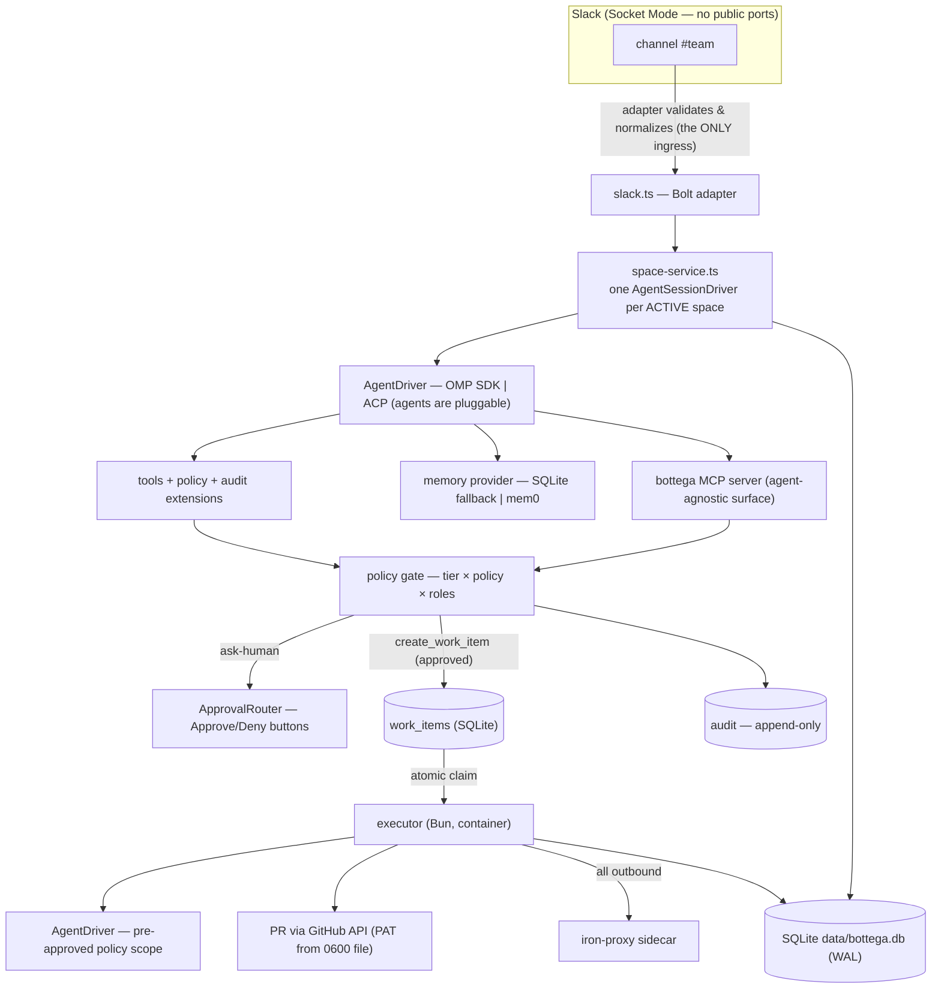
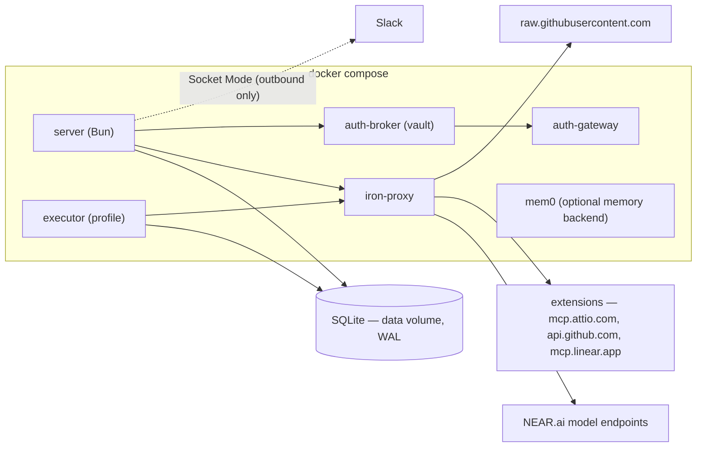
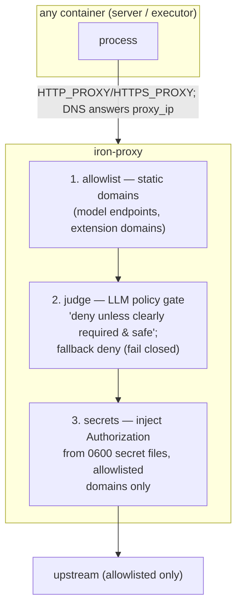
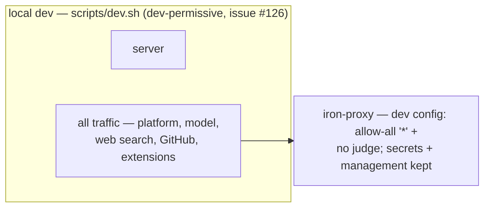
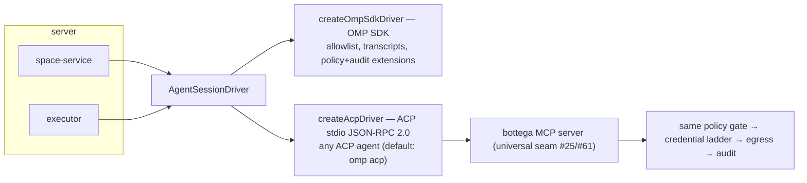
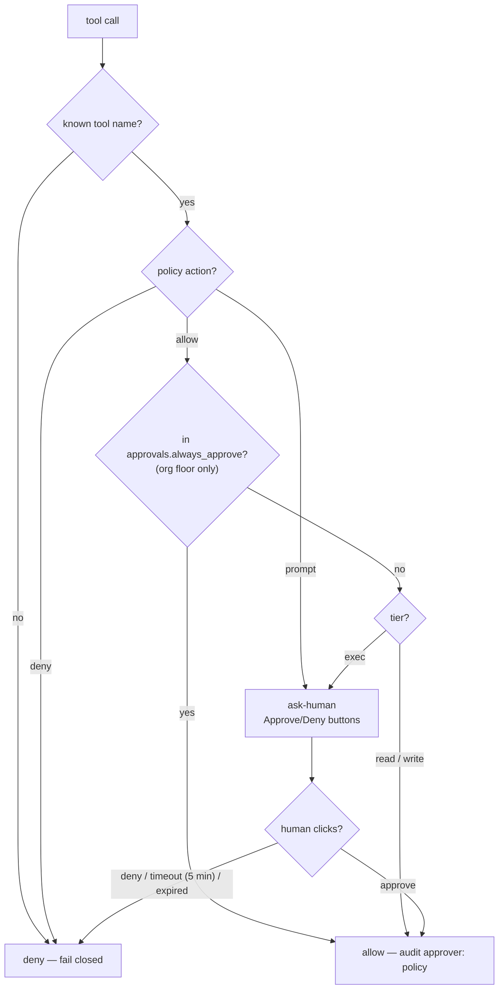
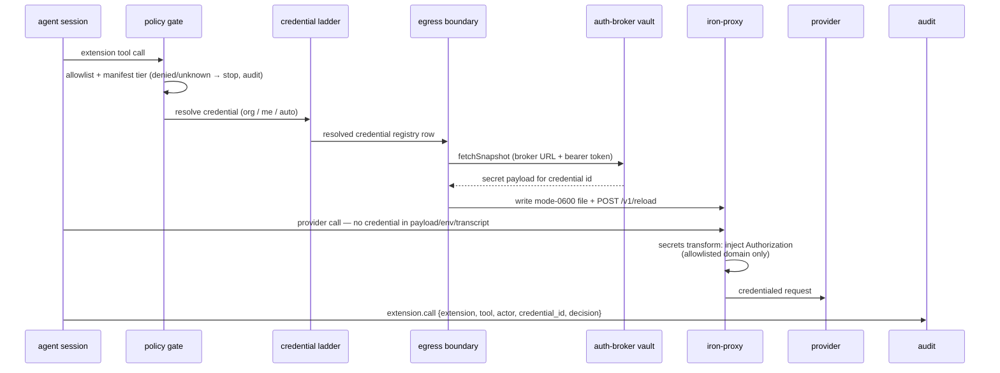
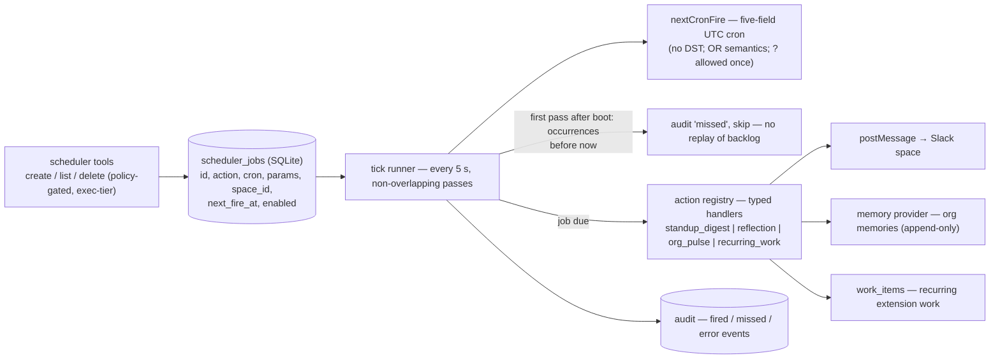
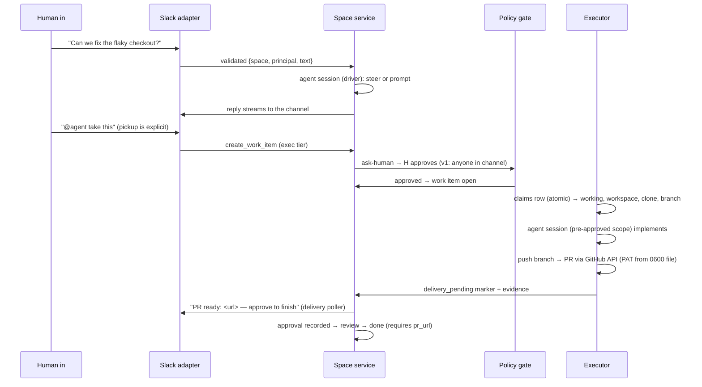
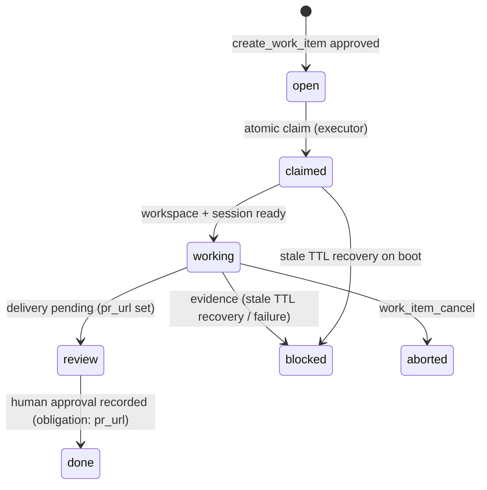

# Architecture

How bottega works under the hood. For user-facing capabilities see
[features.md](features.md); for setup and development see
[README.md](README.md).

## The model: three primitives

1. **Spaces** — a space is a durable shared timeline (messages + work items +
   participants) with its own policy. A Slack channel is a space
   (`slack:<channel_id>`; threads share the channel space in v1). The space,
   not the agent, owns the conversation: anyone can talk, steer, interrupt,
   or approve at any time, and the timeline just keeps appending.
2. **Work items** — the only thing an agent does autonomously. Each runs as
   a scoped agent session with its own workspace, tool allowlist, policy
   context, and audit trail, so parallel work is safe by construction; only
   the conversation serializes in the space.
3. **Actions & policy** — every agent action crosses one policy gate:
   `tier × space policy × roles → allow | deny | ask-human`. Unknown action →
   deny. Policy error → deny. Fail closed is the default.

## System overview



## Runtime topology



Every container in the compose network resolves DNS through iron-proxy
(compose `dns:`), so the proxy is the only path out of the container
network; non-allowlisted hosts get a 403 at the HTTP layer. The server and
the executor share one SQLite file (`bun:sqlite`, WAL, busy_timeout for the
two-process share), migrated idempotently at boot.

## Egress: the iron-proxy boundary

All outbound traffic passes three transforms, in order — allowlist first,
then judge, then secret injection. The judge runs **before** secrets so the
policy LLM never sees real credentials.





**Dev vs deployment egress (#123 → #126).** `ec580a4` made iron-proxy
default-on for local dev: the egress config is reloaded before the server
boots (`POST /v1/reload` on the management API). The strict config's judge
rules denied the server's own model calls (a context-free LLM denies bare
model/API requests) and Slack domains weren't allowlisted at all, which
broke the bot under the dev proxy. Instead of loosening the deployment
contract, local dev now loads the generated **dev-permissive config**
(`config/egress.dev.yml`: allow-all allowlist `"*"` + no judge, secrets +
management kept; mounted only by docker-compose.dev.yml) — so ALL dev
traffic passes the proxy and the secret-injection path stays intact. The
temporary #126 `NO_PROXY` bypass in `scripts/dev.sh` is reverted (the dev
proxy passes everything; routing through it is harmless). `NEARAI_JUDGE_API_KEY`
is a deployment concern only. The compose topology above still routes
everything through the strict config/egress.yml, unchanged.

### Local development topology (#123/#143)

`bun run dev` keeps the production boundaries in the loop instead of
starting the Bun server alone. `scripts/dev.sh`:

1. Seeds each missing `config.yml`, `models.yml`, and `secrets.yml` into
   `data/omp-agent` with `scripts/seed-agent-dir.ts`. Existing files are
   never overwritten; the later model-pin sync only appends a missing
   `modelRoles` block.
2. Requires Docker for iron-proxy, generates the gitignored MITM CA under
   `certs/` on first run, persists a mode-0600 management token, starts the
   proxy with `docker-compose.dev.yml`, and proves readiness by reloading
   `config/egress.dev.yml`.
3. Starts the auth-broker vault on `127.0.0.1:8765`. When the private
   `oh-my-pi/pi:dev` image is unavailable, it falls back to
   `omp auth-broker serve`; that CLI's `PI_CONFIG_DIR` is deliberately
   HOME-relative, while the same mode-0600 token remains at
   `data/.omp/auth-broker.token`.
4. Starts the server only after both boundaries are ready. It exports
   `HTTP_PROXY`/`HTTPS_PROXY`, an internal-only `NO_PROXY`,
   `NODE_EXTRA_CA_CERTS`, `BOTTEGA_PROXY_CONTROL_URL`,
   `BOTTEGA_PROXY_CONTROL_TOKEN`, `OMP_AUTH_BROKER_URL`, and
   `OMP_AUTH_BROKER_TOKEN`. The proxy variables route traffic through the
   proxy, the CA lets Bun verify its MITM certificates, the control pair
   reloads rotated proxy secrets, and the broker pair fetches vault
   credentials.

The broker fallback does not remove the Docker requirement: local
iron-proxy still runs in Compose. Deployment keeps the base
`docker-compose.yml`, strict `config/egress.yml`, internal service names,
and unpublished management/vault ports.

## Agent driver abstraction (agents are pluggable)

The agent is **not** hardwired to OMP. Everything that talks to an agent —
the space service, the executor — depends only on the `AgentDriver` /
`AgentSessionDriver` interfaces in `src/server/drivers/agent-driver.ts`:

```ts
interface AgentSessionDriver {
  prompt(text, opts?: { streamingBehavior?: "steer" | "followUp" }): Promise<void>;
  abort(): Promise<void>;
  isStreaming(): boolean;
  on(event: "message" | "turn_start" | "turn_end" | "error", cb): () => void;
  dispose(): Promise<void>;
  setModelRole?(role: "default" | "fast" | "reasoning"): Promise<...>; // optional (issue #64)
}
interface AgentDriver {
  createSession({ spaceId, transcriptDir, onOutput, cwd?, allowTools? }): Promise<AgentSessionDriver>;
}
```



- **`createOmpSdkDriver`** (default) wraps the OMP SDK. It owns all
  OMP-specific wiring: the space-agent tool allowlist (conversation/read-only
  tools + `task` + `create_work_item`/`work_item_cancel`; **no** bash/write
  on the space agent), file-backed transcripts
  (`data/sessions/<space-id>.jsonl`), a private agent registry per session,
  and the policy + audit extensions.
- **`createAcpDriver`** spawns any ACP-speaking agent (default `omp acp`)
  over stdio JSON-RPC 2.0 (newline-delimited, per the ACP v1 spec). This is
  how a non-OMP agent plugs in later without touching bottega code. OMP is
  the first engine, not a dependency. The org config selects the space-agent
  driver with `agent.driver: acp | omp-sdk` (default `omp-sdk`; the ACP flip
  is opt-in via config until proven — issue #26).
- ACP sessions enforce policy over `session/request_permission`: every
  inbound permission request runs through the same policy table the OMP
  extensions use (tier × org config + space overlay → allow | deny |
  ask-human), with audit on every decision. Unknown tools deny (fail
  closed); ask-human routes through the same Slack button `ApprovalRouter`
  as the OMP driver (issue #44), or `DenyRouter` in headless contexts.
  With `agent.driver: acp`, the bottega MCP server attaches to each session
  so bottega's own tools stay reachable. The MCP surface is the **universal
  agent seam** (issues #25/#61): memory (memory.save/search), the connect
  capability (connect_extension), and every registered extension's manifest
  tools — executed server-side through the same policy gate → credential
  ladder → egress boundary → audit spine as in-session OMP tool calls, so
  any agent (OMP, ACP, or future) gets identical enforcement. The tradeoff
  vs the OMP driver is interception depth: ACP gives allow/deny only, no
  arg rewriting or output redaction. It also cannot switch models
  mid-session: `setModelRole` (issue #64) is an optional
  `AgentSessionDriver` hook that the OMP driver implements (SDK
  `setModel`/`setThinkingLevel`) and the ACP driver reports as
  not-supported — `use_model` surfaces that as an error.

### Model selection stays pinned and fails visibly (#78/#80)

The OMP model registry reads the process-global agent directory, not only a
session option. `createOmpSdkDriver` therefore installs
`data/omp-agent` before creating any session, and both server and executor
run `ensureAgentDirModelPin` first. A missing config is copied from
`config/omp/config.yml`; a parseable stale config gets only the missing
`modelRoles` block appended; an existing or unparseable operator block is
never overwritten. The committed default is pinned to
`opencode-go/deepseek-v4-flash`, so SDK catalog changes cannot silently
select `kimi-k2.7-code`. When opencode auth is unavailable but
`NEAR_API_KEY` is configured, the declared NEAR
`zai-org/GLM-5.1-FP8` model remains the fallback.

After the driver installs the directory, `assertAgentDirModelAvailable`
uses the SDK registry against that directory's `models.yml` (issue #80).
When the file declares providers but none has usable auth, boot stops with
the agent-dir, model-config, and auth cause instead of deferring a
`No model selected` failure to the first Slack message.

Provider failures that the SDK represents as an empty assistant message
are also no longer silent. `OmpSessionDriver` preserves the SDK
`errorMessage` (or error notice) through `turn_end`; `SpaceService` includes
that cause in the empty-response and churn text instead of always guessing
that the model key is wrong.

## Policy & approvals (internals)

`src/policy/` implements the gate. The user-facing view (buttons, response
mode, extension policy config) is in
[features.md](features.md#policy--approvals-user-facing).

1. **Tier** comes from the tool declaration (read / write / exec); unknown
   tools are treated as exec, and unknown *names* always deny.
2. **Policy** = org floor (`config.yml`, fail-closed when absent: everything
   denies) + space overlay (`spaces.policy_json`, can only tighten). Strict
   YAML-subset parsing; any structural error fails the policy closed.
3. **Decision precedence** (issue #45): explicit tool `deny`/`prompt` wins →
   `approvals.always_approve` contains the tool → allow → tier logic
   (`prompt` and `exec` tier → `ask-human`; read/write + allow → allow).
   Exec never fails open.



| Condition | Decision |
| --- | --- |
| Tool has explicit `deny` policy (org floor or space overlay) | deny |
| Tool has explicit `prompt` policy | ask-human |
| Tool in `approvals.always_approve` (org floor only) | allow |
| read/write tier, policy action `allow` | allow |
| exec tier, policy action `allow` (no always_approve) | ask-human |
| Unknown tool name | deny |
| Policy parse/structural error (YAML subset, unknown extension ids) | deny |
| ask-human timeout (`approvals.timeout_minutes`, default 5 min) | deny (prompt rewritten to expired) |
| Headless context (executor, headless MCP) | deny (`DenyRouter` — every ask-human request denies) |

4. **ask-human** posts an interactive Approve/Deny prompt to the space
   channel (Slack block actions `bottega_approve` / `bottega_deny`, issue
   #44) and resolves when a human clicks; the message is rewritten with the
   outcome. Headless contexts use `DenyRouter` — no approval channel there.
5. **`approvals.always_approve`** (org floor only; default off) lists
   exec-tier tools that skip the ask-human prompt when their policy action
   is `allow` — the space overlay can only *remove* entries, never add.
   Auto-approvals audit `approval.resolved` with `approver: "policy"`.
6. **Every decision** is audited (`policy.decision` with tool/tier/decision/
   reason; args redacted), and every ask-human round-trip additionally
   writes `approval.requested` / `approval.resolved` (approver = the Slack
   user who clicked).

**Executor sessions** run with `preApproved: true` policy scope: the work
item's pickup approval (the human-approved `create_work_item` call in the
channel) **is** the authorization. Allowlisted exec tools are then permitted
inside the workspace, while unknown tools still deny and explicit
deny/prompt policies are never bypassed.

**Response mode** mechanics (issue #55; user-facing behavior in features.md):
the org floor sets it in `config.yml`; the space overlay (`spaces.policy_json`)
may change it but can only tighten (`always` → `mention` → `request-only`) —
a looser overlay value is clamped to the org floor, mirroring the tools rule.

**Extension policy** mechanics (issue #56): `extensions.allow`/`deny` take
registered extension ids; empty lists mean no restriction (the registry is
the base allowlist); unknown ids in either list are a structural error — the
policy fails closed. The space overlay can only tighten: `allow` lists ids
to *remove* from the org floor, `deny` lists ids to *add*, and
`org_credentials` clamps like response mode (`allow` → `deny`, never back).
Extension tool calls resolve against the allowlist **before** tier and
approval logic — a denied extension is denied outright (with reason + audit)
and never reaches credential resolution. `org_credentials: deny` makes the
credential ladder's `auto` scope skip org credentials.

## Extension runtime: the safety spine

`src/extensions/` implements the registry (issue #50): an extension is a
typed, declarative integration — **manifest + pinned spec snapshot + vault
binding + policy**. The user-facing view (connect-from-chat, CLI toolset,
heavy layer) is in [features.md](features.md#extensions--the-registry).

1. **Manifest** (`manifest.ts`) — `{ id, label, vendor, kind: "mcp" | "cli",
   mcp?: {serverUrl | command, transport}, cli?: {command, args, env?},
   credentialSchema: {type: oauth | api_key, scopes?}, tools: [{name, tier,
   description, params}], domains: [egress allowlist entries] }`. `kind`
   decides the integration: **mcp** = the provider's OFFICIAL MCP server
   (bottega never implements provider API clients), **cli** = a preinstalled
   CLI in the tools image that bottega shells out to. Validation fails
   closed: duplicate ids, malformed schemas, unresolvable bindings, tool
   names shadowing runtime built-ins — anything invalid is rejected, never
   partially registered.
2. **Pinned spec snapshot** (`registry.ts`) — registration resolves the
   provider's spec from the integrations.sh catalog and snapshots it locally
   PINNED: per-org deployments resolve from `config/extensions/<id>.json`
   files, never from the catalog at runtime. Snapshot format:
   `{ schema: "bottega.extension-snapshot.v1", extensionId, pinnedAt,
   source: { catalog, specId, vendorOfficial, reviewed }, manifest }`.
   Community entries (`vendorOfficial: false`) require explicit
   `reviewed: true` before they register. The catalog fetch itself
   (integrations.sh) is a later issue; it only writes these files.
3. **Vault binding & policy** — `credentialSchema` declares what the vault
   must hold (oauth scopes / api_key); `src/server/index.ts` wires the
   auth-broker secret resolver into the boundary (issues #54/#143). Tool
   `tier` declarations feed both the SDK approval tier and the policy gate.
4. **Wiring** — registry tools become SDK definitions (`tools.ts`) that ride
   the custom-tools path into the space agent's restricted toolset; mcp
   tools call the provider's official MCP server (streamable-http or stdio),
   cli tools spawn the preinstalled command with `--name value` flags.
   Extension `domains` merge into the iron-proxy allowlist via
   `src/egress/generate.ts` (run `bun run src/egress/generate.ts` after
   adding snapshots; `config/egress.yml` is the generated artifact).
5. **Runtime** (`runtime.ts`, issue #53) — every extension tool call crosses
   the safety spine: **policy gate first** (the extension allowlist +
   manifest tier, shared with the in-process policy extension) → **credential
   ladder** (`credentials.ts`, org/me/auto scopes over the store's registry
   rows) → **egress boundary** (`boundary.ts`: `brokerSecretResolverFromEnv`
   fetches the resolved vault row over
   `OMP_AUTH_BROKER_URL`/`OMP_AUTH_BROKER_TOKEN`; the secret is written to
   the extension's shared-volume file, mode 0600, and iron-proxy's
   `secrets` transform injects it as the `Authorization` header for the
   extension's allowlisted domains) → provider call → audit. The client
   call itself carries no credential, so nothing reaches agent env,
   transcripts, or audit. Every call writes `extension.call`
   `{extension, tool, actor, credential_id, decision}`; denied calls never
   resolve a credential. Missing broker configuration, a missing vault row,
   an unsupported credential shape, or a failed proxy reload stops the call
   before it can run unauthenticated.
6. **Agent-agnostic surface** (`src/mcp/server.ts`, issue #61) — the bottega
   MCP server (attached to every ACP session via `mcpServers`, #26)
   advertises `connect_extension` + each registered extension's manifest
   tools and executes them **server-side** through the same #53 runtime /
   #52 connect capability. The gate, ladder, boundary, and audit apply
   identically to every agent — no per-agent adapters. Headless MCP
   contexts have no approval channel: ask-human fails closed (DenyRouter).
7. **Connect intent seam** (`src/server/services/space-service.ts`, issue
   #61) — inbound Slack messages matching the narrow patterns
   `connect <extension>`, `connect <extension> as org`, `connect
   <extension> as me` route directly to the connect capability: no agent
   tool call, no session. Exact shapes only (case-insensitive; anything
   with extra words, punctuation, or keys stays natural-language agent
   territory). Bare / `as me` connects the sender's personal account
   (unprivileged); `as org` crosses the policy gate with the space's
   Slack approval router. api_key-type extensions still need the agent
   tool (or CLI) to supply the key.

**Caller identity and durable-secret hygiene (#121/#152).** The driver
captures the inbound principal when a fresh turn starts and binds it to
that turn (the message's `principal` rides the prompt's turn options);
`SpaceService` exposes it through `getTurnPrincipal`. The in-process
extension-tool bridge derives the space id from the session transcript and
supplies that per-turn principal through `getCaller`, so the credential
ladder's personal lookup matches the Slack human whose message started the
turn rather than the `"agent"` fallback. Personal `connect ... as me`
credentials can therefore be used by later extension calls in that turn
without asking for another token in chat — and because the binding is
per-turn, another user's mid-turn message (a steer) never re-identifies the
running turn's calls as theirs (#152).

The separate `memory.save` boundary in `src/tools/memory.ts` rejects narrow,
obvious credential shapes (including common GitHub, Slack, OpenAI, AWS, and
NEAR tokens) before either persistence or audit. This is a refusal guard,
not a general secret detector: credentials still belong in auth-broker,
while durable memory never receives values the guard recognizes.

The test-only fixture extension (`fixture.ts`) proves the registration and
egress shape end to end. Production snapshots under `config/extensions/`
currently describe Attio, GitHub, and Linear; their official MCP/CLI
surfaces still run through the same runtime rather than bottega-owned
provider API clients.



### CLI surface (thick tools image + spawn path)

`kind: "cli"` extensions run curated, preinstalled CLIs — zero client code,
no SDK. Three pieces (issues #58, #62, #63):

1. **Tools image** (`Dockerfile.tools`) — oven/bun:1 plus the curated CLI
   set v1.1 (the full list and the heavy/optional layer are in
   [features.md](features.md#extensions--the-registry)). NO credentials are
   baked in, ever. The app image (`Dockerfile`) builds **FROM** the tools
   image (issue #62), so the single `bottega:${BOTTEGA_IMAGE_TAG}` image —
   used by BOTH the server and the executor entrypoints — carries the
   CLIs live on PATH in the executor container; build the tools image
   first (`docker build -f Dockerfile.tools -t bottega-tools:ci .`). The
   tools image is built in the CI **docker** job (not the fast
   check/test job) so the default CI stays under 5 minutes, and locally
   for extension development. Push/pull of a cached build from a registry
   is a deploy concern, not this job's.
2. **Spawn path** (`src/extensions/tools.ts`) — a cli tool executes the
   manifest's binary with the manifest's fixed `args` first, then the
   call's params as `--name value` flags (`--name` alone for boolean
   true). The child env is the parent env minus credential-named variables
   (`CREDENTIAL_ENV_RE` in `manifest.ts`), plus the manifest's
   credential-free `env` delta — a manifest that declares a credential in
   `cli.env` is rejected (fail closed).
3. **Per-org CLI extension** — an org that needs a CLI outside the curated
   set extends the image itself, never the default: append to
   `Dockerfile.tools` in the org's fork (keeping the curated baseline
   intact), or mount a local layer at deploy time (a one-line
   `FROM bottega-tools:latest` image with the org's packages, or a volume
   with static binaries). The curated set stays the baseline by design.

**Credentials never travel via env.** Auth for CLI tools happens at the
iron-proxy boundary: the executor points `HTTPS_PROXY` at iron-proxy, the
egress allowlist (`src/egress`) gates which domains are reachable, and the
proxy injects the credential for the allowlisted domain at request time.
Per-request credential selection (caller/scope → credential id) is the
runtime's concern (issue #53); this surface delivers the spawn path and
the no-credential-in-env guarantee. gRPC-heavy CLIs (gcloud, kubectl — both
in the opt-in heavy layer above) do not fit the HTTP-proxy boundary and
get partial support (documented limitation): they can run for
non-authenticated operations, but credentialed gRPC calls are not
supported.

## Scheduler: durable cron (epic #111)

`src/scheduler/` implements a durable, UTC-only scheduler with policy-gated
tools (issue #86) and four built-in actions: standups (#92), reflection
(#93), org pulse (#90), and recurring work-item dispatch (#131).



- **Boot skip policy, not catch-up** — on the first successful tick after
  boot, every occurrence strictly before boot time is audited as `missed`
  and the job advances to its next future occurrence. The runner never
  replays a backlog after downtime.
- **No overlap** — scheduler passes never run concurrently (single tick
  runner, non-overlapping), so a slow action can't double-fire.
- **Fail closed** — jobs and actions resolve through the same policy,
  memory, and audit spines as everything else; a firing job with invalid
  params is audited as an error, not silently dropped.
- **Opt-in per space** — humans enable standups/reflection in
  `spaces.policy_json` with `proactive: { standup: true, reflection: true }`;
  invalid policy data fails closed (disabled). The org pulse targets a
  configured Slack space.

## Knowledge-base ingestion (#91)

Knowledge-base ingestion is an explicit write path, not a scheduler action.
`config/kb.yml` declares unique HTTP(S) document sources without embedded
credentials. `kb_ingest` in `src/tools/kb-tools.ts` refreshes either one
source id or all sources in declaration order; it is a write-tier
space-agent tool and its source host must still pass the active egress
policy.

`src/kb/ingest.ts` is deterministic and model-free:

1. Fetch with a 10-second timeout and 5 MiB response cap.
2. Convert HTML structure to text when needed, then split on Markdown
   headings and paragraph boundaries. Headed chunks repeat the heading and
   stay at or below 2,000 characters.
3. Append every chunk to shared org memory with
   `{ kind: "kb", source, url }` metadata.
4. Append one redacted `memory.write` audit row per saved chunk, recording
   the memory id and content hash rather than the chunk text.

Refreshes are append-only; the pipeline does not delete or replace earlier
memories. The same functions back manual one-source and all-source runs, so
there is no model-dependent summarization branch.

## Proactive onboarding (#116)

The first-run checks have one implementation, `runWizardChecks` in
`src/tools/admin.ts`, shared by the `first_run_wizard` tool, boot, and
in-conversation recovery:

- At boot, `src/server/index.ts` reads the org setting
  `onboarding.space_id`. If any checks fail, it posts one guided message to
  that space for that boot and audits `admin.onboarding_boot`. No configured
  space means no post. A Slack posting failure is logged and audited but
  does not prevent the server from booting.
- During a conversation, `SpaceService` appends the same guidance when a
  session error or repeated-empty-completion churn meets failing checks.
  The nudge is deduplicated per space and failing-check set, not per
  message. A changed failure set can nudge again; successful checks clear
  the record so a later regression is visible. Check failures suppress only
  the nudge, never the underlying error reply.

## Slack responsiveness and delivery (#119/#120)

For normal agent-bound messages, `SpaceService` performs receipt work before
attachment ingestion or a session cold start:

1. Record the inbound timestamp and real principal.
2. Post the rotating thinking phrase, add a 👀 reaction to the inbound
   message, and append `message.in`, all fire-and-forget.
3. Create or reuse the session and submit the turn.

The direct connect-intent path and messages dropped during session disposal
skip those receipt claims because they do not enter an agent turn. Reaction
add/remove failures (including a missing Slack `reactions:write` scope) are
logged but never fail the turn. A visible reply or error removes every
pending receipt reaction for the space.

Receipt audit payloads contain the Slack timestamp, never message text.
The first visible reply/error consumes the receipt clock and appends
`message.reply` with `latency_ms` and, when a phrase was posted,
`phrase_ms`. Empty retry bookkeeping does not manufacture a reply row.

On a steered streaming turn, the latest reply text wins and in-place Slack
updates are coalesced to at most one per
`STREAM_UPDATE_INTERVAL_MS` (1,000 ms). `turn_end` immediately flushes the
final text; failures are retained and retried on the same cadence up to the
bounded final retry limit. Interim failures wait for that final flush.
Non-streaming replies keep the direct, unbatched update path.

## Data flow: "issue shared in Slack gets implemented"



## Persistence & audit

One SQLite file (`bun:sqlite`, WAL, busy_timeout for the server+executor
two-process share), migrated idempotently at boot:

- `spaces` — space registry + per-space policy overlay.
- `work_items` — the queue and the state machine below, with a legal-move
  map enforced in the store (single choke point) and obligations: `done`
  requires a `pr_url`, `blocked` requires evidence, `review` requires a
  recorded approval. Stale rows (`claimed`/`working` past a TTL) are
  recovered to `blocked` with evidence on boot.
- `scheduler_jobs` — durable cron rows (id, action, cron, params,
  space_id, next_fire_at, last_result, enabled).
- `audit` — append-only; UPDATE/DELETE rejected by triggers. Every policy
  decision, approval, tool call (redacted), and work-item transition is a
  row. Payloads are redacted (secret-shaped values → `[REDACTED]`) and
  capped at 4 KB before write.



The space timeline itself is the OMP session file (`.jsonl` under
`data/sessions/`) — durable by construction, never deleted. LLM/agent data
is never deleted: "cleanup" evicts caches, never rows.

## Multiplayer & concurrency

- Many humans + one space agent: prompts during a stream **steer** (or queue
  as follow-ups); anyone can interrupt (`abort`).
- Idle spaces dispose their session (default 30 min) and cold-start on the
  next message — disposal is cache eviction, never data loss.
- Work items are independent sessions: parallel work is isolated by design.
- One process, many sessions: each session gets a private agent registry
  (OMP SDK requirement for concurrent top-level sessions).

## Safety model

| Threat surface | Control |
|---|---|
| Untrusted ingress | Adapters validate every event; only adapters mint messages |
| Credential exposure | Provider keys in auth-broker vault; Slack tokens only in server `.env`; git PAT only in a mode-0600 file on the data volume; OMP secret obfuscation (`secrets.enabled`); extension credentials injected at the proxy boundary, never in env/transcripts |
| Malicious repo content | Work items run in the executor container in disposable workspaces; server never mounts repo paths |
| Exfiltration / rogue egress | Default-deny deployment egress through iron-proxy: static allowlist, LLM judge on allowlisted traffic, DNS sinkhole (containers resolve only through the proxy). Local dev still routes all traffic through iron-proxy, but `config/egress.dev.yml` deliberately uses allow-all with no judge while retaining secret injection and management (#123/#126) |
| Unauthorized side effects | Policy gate on every tool call; exec prompts to humans; unknown → deny |
| Data loss / tampering | Append-only audit (SQLite triggers reject UPDATE/DELETE), transcripts retained, never deleted |
| Failure | Fail closed: parse errors, policy errors, model outages, missing tokens → deny or block with evidence |

## Verification architecture

The default Bun suite stays hermetic. `src/server/boot-wiring.test.ts`
drives a real `main()` in a temporary working directory and observes the
caller-level session toolset, proving scheduler/KB registration, model-pin
sync, fail-closed Slack-token boot, and the ACP driver flip without opening
a Slack connection. `src/server/onboarding-boot.test.ts` uses the same real
composition-root shape for the proactive boot post.

`bunfig.toml` excludes only live-connection helpers from coverage.
`bun run scripts/check-coverage.ts` runs the full suite with coverage,
parses Bun's aggregate `All files` row, and enforces 85% for both lines and
functions. The separate script is intentional: Bun 1.3.14 applies
`coverageThreshold` per file rather than to the suite aggregate.

Real infrastructure keeps an opt-in leg rather than entering the hermetic
default: Mem0 and strict/dev iron-proxy legs run with
`BOTTEGA_RUN_INTEGRATION=1`; the opencode provider leg requires a usable
key and gateway; the auth-broker leg exercises the personal credential →
vault fetch → secret file → proxy injection → GitHub chain. Each leg either
records the real assertion or prints a concrete skip reason when Docker,
an image, a key, the gateway, or the broker is unavailable.

## Repository layout

```
src/
  server/           index.ts (composition root)
  server/adapters/  slack.ts
  server/drivers/   agent-driver.ts (AgentDriver + OMP SDK), acp-driver.ts
  server/services/  space-service.ts, delivery-poller.ts
  policy/           config.ts, extension.ts, approval-router.ts, audit.ts
  extensions/       registry (manifest + pinned snapshots + tool bridge)
  scheduler/        cron.ts, store.ts, runner.ts, actions.ts (standup/reflection/pulse/recurring work)
  kb/               doc ingestion pipeline (kb_ingest)
  store/            db.ts, schema.sql
  tools/            work-items.ts, memory.ts, kb-tools.ts, helpers.ts
  memory/           sqlite.ts, mem0.ts, types.ts (providers behind one interface)
  mcp/              server.ts (bottega-hosted MCP surface: memory + connect + extension tools, #25/#61)
  executor.ts       containerized work-item runner (claim → PR)
  yaml-subset.ts    shared strict YAML-subset parser (configs + tests)
  egress/           generate.ts (allowlist from extension domains) + tests: compose topology, egress.yml, iron-proxy leg
  secrets/          broker/gateway wiring + tests: credential boundary, omp templates, agent-dir
config/
  extensions/       pinned extension snapshots (one JSON per extension)
  egress.yml        generated iron-proxy allowlist + judge policy (transforms: allowlist → judge → secrets)
  egress.dev.yml    generated local-dev allow-all/no-judge config (secrets + management retained)
  omp/              config.yml (secrets.enabled), secrets.yml, models.yml
  org.yml           executor repos + git base
  kb.yml            knowledge-base document sources (#91)
  entrypoints/      broker.sh (auth-broker token bootstrap)
Dockerfile          single image (server + executor entrypoints), bun user
Dockerfile.tools    curated CLI image (built in CI docker job)
Dockerfile.tools-heavy  opt-in Rust/kubectl/helm/gcloud layer (NOT default)
docker-compose.yml  server, executor (profile), auth-broker, auth-gateway, iron-proxy, mem0
docker-compose.dev.yml  local-dev overlay (host-only proxy + auth-broker ports, host data bind)
scripts/dev.sh      dev boot: agent-dir seed, MITM CA, permissive proxy, broker/CLI fallback, env export
scripts/smoke.sh    local checks + manual checklist
scripts/e2e-smoke.sh  compose e2e smoke leg: fail-closed boots + wiring (skip-gated)
bunfig.toml         coverage exclusions for live-only helpers
scripts/check-coverage.ts  aggregate line/function coverage gate (85%)
scripts/seed-agent-dir.ts  per-file, only-if-missing OMP template seed
tests/e2e/          skip-gated live provider/proxy/broker legs with evidence
```
