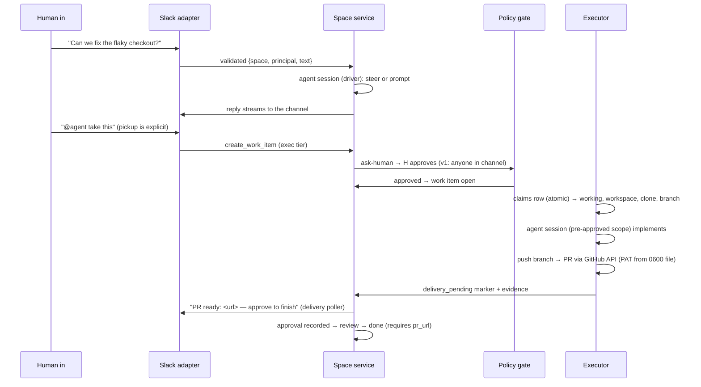

# Architecture

How bottega works under the hood. For user-facing capabilities see
[features.md](features.md); for setup and development see
[README.md](README.md).

## The model: three primitives

1. **Spaces** — a space is a durable shared timeline (messages + work items +
   participants) with its own policy. A Slack channel is a space
   (`slack:<channel_id>`; threads share the channel space in v1). The space,
   not the agent, owns the conversation: anyone can talk, steer, interrupt,
   or approve at any time, and the timeline just keeps appending.
2. **Work items** — the only thing an agent does autonomously. Each runs as
   a scoped agent session with its own workspace, tool allowlist, policy
   context, and audit trail, so parallel work is safe by construction; only
   the conversation serializes in the space.
3. **Actions & policy** — every agent action crosses one policy gate:
   `tier × space policy × roles → allow | deny | ask-human`. Unknown action →
   deny. Policy error → deny. Fail closed is the default.

## Components

```
 Slack (Socket Mode — no public ports)
        │  adapter validates & normalizes (the ONLY ingress)
        ▼
┌─────────────────────────── server (Bun) ───────────────────────────┐
│  slack.ts          Bolt adapter: message → space, replies, buttons  │
│  space-service.ts  one AgentSessionDriver per ACTIVE space          │
│  agent-driver.ts   AgentDriver abstraction (agents are pluggable)   │
│  acp-driver.ts     ACP driver: spawns any ACP agent (e.g. omp acp)  │
│  policy/*          action gate + approval router + audit writer     │
│  delivery-poller.ts  posts "PR ready" announcements to the channel  │
│  index.ts          wiring: store + adapter + driver + extensions    │
└───────────────────────────────────┬──────────────────────────────────┘
                                    │ SQLite (data/bottega.db, WAL)
┌─────────────────────────── executor (Bun, container) ──────────────┐
│  polls work_items (atomic claim) → workspace per item → agent       │
│  session (AgentDriver, pre-approved policy scope) → branch → PR     │
└───────────────────────────────────┬──────────────────────────────────┘
                                    │ all outbound traffic
                        ┌───────────▼───────────┐
                        │  iron-proxy sidecar   │  default-deny allowlist,
                        │  auth-broker/gateway  │  LLM-judge, DNS sinkhole,
                        └───────────────────────┘  secrets at the boundary
```

## Agent driver abstraction (agents are pluggable)

The agent is **not** hardwired to OMP. Everything that talks to an agent —
the space service, the executor — depends only on the `AgentDriver` /
`AgentSessionDriver` interfaces in `src/server/drivers/agent-driver.ts`:

```ts
interface AgentSessionDriver {
  prompt(text, opts?: { streamingBehavior?: "steer" | "followUp" }): Promise<void>;
  abort(): Promise<void>;
  isStreaming(): boolean;
  on(event: "message" | "turn_start" | "turn_end" | "error", cb): () => void;
  dispose(): Promise<void>;
  setModelRole?(role: "default" | "fast" | "reasoning"): Promise<...>; // optional (issue #64)
}
interface AgentDriver {
  createSession({ spaceId, transcriptDir, onOutput, cwd?, allowTools? }): Promise<AgentSessionDriver>;
}
```

- **`createOmpSdkDriver`** (default) wraps the OMP SDK. It owns all
  OMP-specific wiring: the space-agent tool allowlist (conversation/read-only
  tools + `task` + `create_work_item`/`work_item_cancel`; **no** bash/write
  on the space agent), file-backed transcripts
  (`data/sessions/<space-id>.jsonl`), a private agent registry per session,
  and the policy + audit extensions.
- **`createAcpDriver`** spawns any ACP-speaking agent (default `omp acp`)
  over stdio JSON-RPC 2.0 (newline-delimited, per the ACP v1 spec). This is
  how a non-OMP agent plugs in later without touching bottega code. OMP is
  the first engine, not a dependency. The org config selects the space-agent
  driver with `agent.driver: acp | omp-sdk` (default `omp-sdk`; the ACP flip
  is opt-in via config until proven — issue #26).
- ACP sessions enforce policy over `session/request_permission`: every
  inbound permission request runs through the same policy table the OMP
  extensions use (tier × org config + space overlay → allow | deny |
  ask-human), with audit on every decision. Unknown tools deny (fail
  closed); ask-human routes through the same Slack button `ApprovalRouter`
  as the OMP driver (issue #44), or `DenyRouter` in headless contexts.
  With `agent.driver: acp`, the bottega MCP server attaches to each session
  so bottega's own tools stay reachable. The MCP surface is the **universal
  agent seam** (issues #25/#61): memory (memory.save/search), the connect
  capability (connect_extension), and every registered extension's manifest
  tools — executed server-side through the same policy gate → credential
  ladder → egress boundary → audit spine as in-session OMP tool calls, so
  any agent (OMP, ACP, or future) gets identical enforcement. The tradeoff
  vs the OMP driver is interception depth: ACP gives allow/deny only, no
  arg rewriting or output redaction. It also cannot switch models
  mid-session: `setModelRole` (issue #64) is an optional
  `AgentSessionDriver` hook that the OMP driver implements (SDK
  `setModel`/`setThinkingLevel`) and the ACP driver reports as
  not-supported — `use_model` surfaces that as an error.

## Policy & approvals (internals)

`src/policy/` implements the gate. The user-facing view (buttons, response
mode, extension policy config) is in [features.md](features.md#policy--approvals-user-facing).

1. **Tier** comes from the tool declaration (read / write / exec); unknown
   tools are treated as exec, and unknown *names* always deny.
2. **Policy** = org floor (`config.yml`, fail-closed when absent: everything
   denies) + space overlay (`spaces.policy_json`, can only tighten). Strict
   YAML-subset parsing; any structural error fails the policy closed.
3. **Decision precedence** (issue #45): explicit tool `deny`/`prompt` wins →
   `approvals.always_approve` contains the tool → allow → tier logic
   (`prompt` and `exec` tier → `ask-human`; read/write + allow → allow).
   Exec never fails open.

| Condition | Decision |
| --- | --- |
| Tool has explicit `deny` policy (org floor or space overlay) | deny |
| Tool has explicit `prompt` policy | ask-human |
| Tool in `approvals.always_approve` (org floor only) | allow |
| read/write tier, policy action `allow` | allow |
| exec tier, policy action `allow` (no always_approve) | ask-human |
| Unknown tool name | deny |
| Policy parse/structural error (YAML subset, unknown extension ids) | deny |
| ask-human timeout (`approvals.timeout_minutes`, default 5 min) | deny (prompt rewritten to expired) |
| Headless context (executor, headless MCP) | deny (`DenyRouter` — every ask-human request denies) |

4. **ask-human** posts an interactive Approve/Deny prompt to the space
   channel (Slack block actions `bottega_approve` / `bottega_deny`, issue
   #44) and resolves when a human clicks; the message is rewritten with the
   outcome. Headless contexts use `DenyRouter` — no approval channel there.
5. **`approvals.always_approve`** (org floor only; default off) lists
   exec-tier tools that skip the ask-human prompt when their policy action
   is `allow` — the space overlay can only *remove* entries, never add.
   Auto-approvals audit `approval.resolved` with `approver: "policy"`.
6. **Every decision** is audited (`policy.decision` with tool/tier/decision/
   reason; args redacted), and every ask-human round-trip additionally
   writes `approval.requested` / `approval.resolved` (approver = the Slack
   user who clicked).

**Executor sessions** run with `preApproved: true` policy scope: the work
item's pickup approval (the human-approved `create_work_item` call in the
channel) **is** the authorization. Allowlisted exec tools are then permitted
inside the workspace, while unknown tools still deny and explicit
deny/prompt policies are never bypassed.

**Response mode** mechanics (issue #55; user-facing behavior in features.md):
the org floor sets it in `config.yml`; the space overlay (`spaces.policy_json`)
may change it but can only tighten (`always` → `mention` → `request-only`) —
a looser overlay value is clamped to the org floor, mirroring the tools rule.

**Extension policy** mechanics (issue #56): `extensions.allow`/`deny` take
registered extension ids; empty lists mean no restriction (the registry is
the base allowlist); unknown ids in either list are a structural error — the
policy fails closed. The space overlay can only tighten: `allow` lists ids
to *remove* from the org floor, `deny` lists ids to *add*, and
`org_credentials` clamps like response mode (`allow` → `deny`, never back).
Extension tool calls resolve against the allowlist **before** tier and
approval logic — a denied extension is denied outright (with reason + audit)
and never reaches credential resolution. `org_credentials: deny` makes the
credential ladder's `auto` scope skip org credentials.

## Extension registry (typed integrations)

`src/extensions/` implements the registry (issue #50): an extension is a
typed, declarative integration — **manifest + pinned spec snapshot + vault
binding + policy**. The user-facing view (connect-from-chat, CLI toolset,
heavy layer) is in [features.md](features.md#extensions--the-registry).

1. **Manifest** (`manifest.ts`) — `{ id, label, vendor, kind: "mcp" | "cli",
   mcp?: {serverUrl | command, transport}, cli?: {command, args, env?},
   credentialSchema: {type: oauth | api_key, scopes?}, tools: [{name, tier,
   description, params}], domains: [egress allowlist entries] }`. `kind`
   decides the integration: **mcp** = the provider's OFFICIAL MCP server
   (bottega never implements provider API clients), **cli** = a preinstalled
   CLI in the tools image that bottega shells out to. Validation fails
   closed: duplicate ids, malformed schemas, unresolvable bindings, tool
   names shadowing runtime built-ins — anything invalid is rejected, never
   partially registered.
2. **Pinned spec snapshot** (`registry.ts`) — registration resolves the
   provider's spec from the integrations.sh catalog and snapshots it locally
   PINNED: per-org deployments resolve from `config/extensions/<id>.json`
   files, never from the catalog at runtime. Snapshot format:
   `{ schema: "bottega.extension-snapshot.v1", extensionId, pinnedAt,
   source: { catalog, specId, vendorOfficial, reviewed }, manifest }`.
   Community entries (`vendorOfficial: false`) require explicit
   `reviewed: true` before they register. The catalog fetch itself
   (integrations.sh) is a later issue; it only writes these files.
3. **Vault binding & policy** — `credentialSchema` declares what the vault
   must hold (oauth scopes / api_key); the broker/vault wiring and the three
   provider extensions are their own issues. Tool `tier` declarations feed
   both the SDK approval tier and the policy gate.
4. **Wiring** — registry tools become SDK definitions (`tools.ts`) that ride
   the custom-tools path into the space agent's restricted toolset; mcp
   tools call the provider's official MCP server (streamable-http or stdio),
   cli tools spawn the preinstalled command with `--name value` flags.
   Extension `domains` merge into the iron-proxy allowlist via
   `src/egress/generate.ts` (run `bun run src/egress/generate.ts` after
   adding snapshots; `config/egress.yml` is the generated artifact).
5. **Runtime** (`runtime.ts`, issue #53) — every extension tool call crosses
   the safety spine: **policy gate first** (the extension allowlist +
   manifest tier, shared with the in-process policy extension) → **credential
   ladder** (`credentials.ts`, org/me/auto scopes over the store's registry
   rows) → **egress boundary** (`boundary.ts`: the resolved credential is
   written to the extension's secret file on the shared data volume, mode
   0600, and iron-proxy's `secrets` transform **injects** it as the
   `Authorization` header for the extension's allowlisted domains — the
   call itself carries no credential, so nothing reaches agent env,
   transcripts, or audit) → provider call → audit. Every call writes
   `extension.call` `{extension, tool, actor, credential_id, decision}`;
   denied calls never resolve a credential. The broker secret fetch that
   feeds the boundary is the real-provider issue's wiring; until then calls
   fail closed at the boundary.
6. **Agent-agnostic surface** (`src/mcp/server.ts`, issue #61) — the bottega
   MCP server (attached to every ACP session via `mcpServers`, #26)
   advertises `connect_extension` + each registered extension's manifest
   tools and executes them **server-side** through the same #53 runtime /
   #52 connect capability. The gate, ladder, boundary, and audit apply
   identically to every agent — no per-agent adapters. Headless MCP
   contexts have no approval channel: ask-human fails closed (DenyRouter).
7. **Connect intent seam** (`src/server/services/space-service.ts`, issue
   #61) — inbound Slack messages matching the narrow patterns
   `connect <extension>`, `connect <extension> as org`, `connect
   <extension> as me` route directly to the connect capability: no agent
   tool call, no session. Exact shapes only (case-insensitive; anything
   with extra words, punctuation, or keys stays natural-language agent
   territory). Bare / `as me` connects the sender's personal account
   (unprivileged); `as org` crosses the policy gate with the space's
   Slack approval router. api_key-type extensions still need the agent
   tool (or CLI) to supply the key.

The test-only fixture extension (`fixture.ts`) proves the shape end to end:
registered → resolves → its tool appears in the space agent's toolset → its
domain lands in the merged egress allowlist. No extension implementations
ship in this issue — the three providers are their own issues.

### CLI surface (thick tools image + spawn path)

`kind: "cli"` extensions run curated, preinstalled CLIs — zero client code,
no SDK. Three pieces (issues #58, #62, #63):

1. **Tools image** (`Dockerfile.tools`) — oven/bun:1 plus the curated CLI
   set v1.1 (the full list and the heavy/optional layer are in
   [features.md](features.md#extensions--the-registry)). NO credentials are
   baked in, ever. The app image (`Dockerfile`) builds **FROM** the tools
   image (issue #62), so the single `bottega:${BOTTEGA_IMAGE_TAG}` image —
   used by BOTH the server and the executor entrypoints — carries the
   CLIs live on PATH in the executor container; build the tools image
   first (`docker build -f Dockerfile.tools -t bottega-tools:ci .`). The
   tools image is built in the CI **docker** job (not the fast
   check/test job) so the default CI stays under 5 minutes, and locally
   for extension development. Push/pull of a cached build from a registry
   is a deploy concern, not this job's.
2. **Spawn path** (`src/extensions/tools.ts`) — a cli tool executes the
   manifest's binary with the manifest's fixed `args` first, then the
   call's params as `--name value` flags (`--name` alone for boolean
   true). The child env is the parent env minus credential-named variables
   (`CREDENTIAL_ENV_RE` in `manifest.ts`), plus the manifest's
   credential-free `env` delta — a manifest that declares a credential in
   `cli.env` is rejected (fail closed).
3. **Per-org CLI extension** — an org that needs a CLI outside the curated
   set extends the image itself, never the default: append to
   `Dockerfile.tools` in the org's fork (keeping the curated baseline
   intact), or mount a local layer at deploy time (a one-line
   `FROM bottega-tools:latest` image with the org's packages, or a volume
   with static binaries). The curated set stays the baseline by design.

**Credentials never travel via env.** Auth for CLI tools happens at the
iron-proxy boundary: the executor points `HTTPS_PROXY` at iron-proxy, the
egress allowlist (`src/egress`) gates which domains are reachable, and the
proxy injects the credential for the allowlisted domain at request time.
Per-request credential selection (caller/scope → credential id) is the
runtime's concern (issue #53); this surface delivers the spawn path and
the no-credential-in-env guarantee. gRPC-heavy CLIs (gcloud, kubectl — both
in the opt-in heavy layer above) do not fit the HTTP-proxy boundary and
get partial support (documented limitation): they can run for
non-authenticated operations, but credentialed gRPC calls are not
supported.

## Data flow: "issue shared in Slack gets implemented"



## Safety model

| Threat surface | Control |
|---|---|
| Untrusted ingress | Adapters validate every event; only adapters mint messages |
| Credential exposure | Provider keys in auth-broker vault; Slack tokens only in server `.env`; git PAT only in a mode-0600 file on the data volume; OMP secret obfuscation (`secrets.enabled`) |
| Malicious repo content | Work items run in the executor container in disposable workspaces; server never mounts repo paths |
| Exfiltration / rogue egress | All outbound traffic through iron-proxy: default-deny allowlist (model endpoints: cloud-api.near.ai, *.completions.near.ai), LLM-judge on allowlisted traffic, DNS sinkhole (containers resolve only through the proxy) |
| Unauthorized side effects | Policy gate on every tool call; exec prompts to humans; unknown → deny |
| Data loss / tampering | Append-only audit (SQLite triggers reject UPDATE/DELETE), transcripts retained, never deleted |
| Failure | Fail closed: parse errors, policy errors, model outages, missing tokens → deny or block with evidence |

## Persistence & audit

One SQLite file (`bun:sqlite`, WAL, busy_timeout for the server+executor
two-process share), migrated idempotently at boot:

- `spaces` — space registry + per-space policy overlay.
- `work_items` — the queue and the state machine: `open → claimed → working
  → review → done | blocked | aborted`, with a legal-move map enforced in the
  store (single choke point) and obligations: `done` requires a `pr_url`,
  `blocked` requires evidence, `review` requires a recorded approval. Stale
  rows (`claimed`/`working` past a TTL) are recovered to `blocked` with
  evidence on boot.
- `audit` — append-only; UPDATE/DELETE rejected by triggers. Every policy
  decision, approval, tool call (redacted), and work-item transition is a
  row. Payloads are redacted (secret-shaped values → `[REDACTED]`) and capped
  at 4 KB before write.

The space timeline itself is the OMP session file (`.jsonl` under
`data/sessions/`) — durable by construction, never deleted.

## Multiplayer & concurrency

- Many humans + one space agent: prompts during a stream **steer** (or queue
  as follow-ups); anyone can interrupt (`abort`).
- Idle spaces dispose their session (default 30 min) and cold-start on the
  next message — disposal is cache eviction, never data loss.
- Work items are independent sessions: parallel work is isolated by design.
- One process, many sessions: each session gets a private agent registry
  (OMP SDK requirement for concurrent top-level sessions).

## Repository layout

```
src/
  server/           index.ts (composition root)
  server/adapters/  slack.ts
  server/drivers/   agent-driver.ts (AgentDriver + OMP SDK), acp-driver.ts
  server/services/  space-service.ts, delivery-poller.ts
  policy/           config.ts, extension.ts, approval-router.ts, audit.ts
  extensions/       registry (manifest + pinned snapshots + tool bridge)
  store/            db.ts, schema.sql
  tools/            work-items.ts, memory.ts, helpers.ts
  memory/           sqlite.ts, mem0.ts, types.ts (providers behind one interface)
  mcp/              server.ts (bottega-hosted MCP surface: memory + connect + extension tools, #25/#61)
  executor.ts       containerized work-item runner (claim → PR)
  yaml-subset.ts    shared strict YAML-subset parser (configs + tests)
  egress/           generate.ts (allowlist from extension domains) + tests: compose topology, egress.yml, iron-proxy leg
  secrets/          broker/gateway wiring + tests: credential boundary, omp templates, agent-dir
config/
  extensions/       pinned extension snapshots (one JSON per extension)
  egress.yml        generated iron-proxy allowlist + judge policy
  omp/              config.yml (secrets.enabled), secrets.yml, models.yml
  org.yml           executor repos + git base
  entrypoints/      broker.sh (auth-broker token bootstrap)
Dockerfile          single image (server + executor entrypoints), bun user
docker-compose.yml  server, executor (profile), auth-broker, auth-gateway, iron-proxy, mem0
slack-app-manifest.yml
scripts/smoke.sh    local checks + manual checklist
scripts/e2e-smoke.sh  compose e2e smoke leg: fail-closed boots + wiring (skip-gated)
```
