# Architecture

How bottega works under the hood. For user-facing capabilities see
[features.md](features.md); for setup and development see
[setup.md](setup.md).

## The model: three primitives

1. **Spaces** — a space is a durable shared timeline (messages + work items +
   participants) with its own policy. A Slack channel is a space
   (`slack:<channel_id>`; threads share the channel space in v1). The space,
   not the agent, owns the conversation: anyone can talk, steer, interrupt,
   or approve at any time, and the timeline just keeps appending.
2. **Work items** — the only thing an agent does autonomously. Each runs as
   a scoped agent session with its own workspace, tool allowlist, policy
   context, and audit trail, so parallel work is safe by construction; only
   the conversation serializes in the space.
3. **Actions & policy** — every agent action crosses one policy gate:
   `tier × space policy × roles → allow | deny | ask-human`. Unknown action →
   deny. Policy error → deny. Fail closed is the default.

## System overview

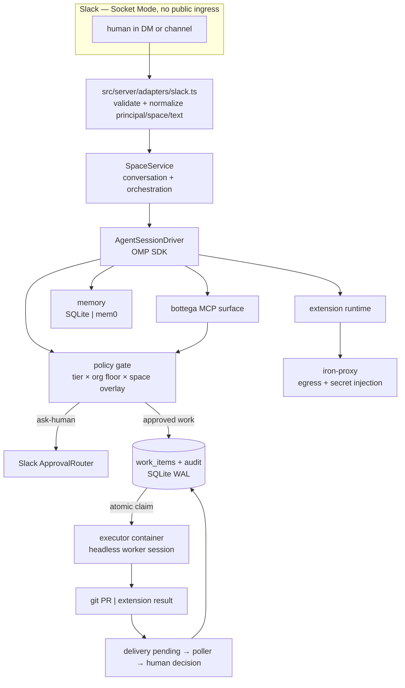

## Runtime topology

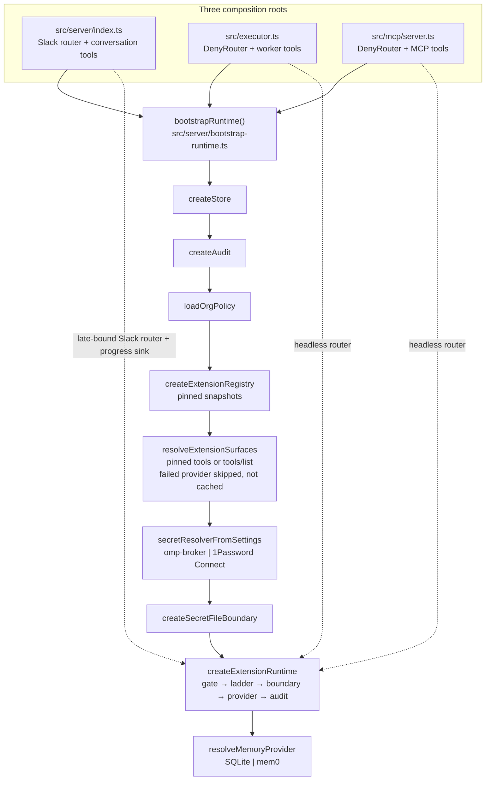

Issue #172 makes that chain the single construction site. Server, executor,
and MCP may assemble different visible tool subsets, but they cannot silently
select a different memory backend, registry, or secret resolver. The
caller-level parity suite in `src/server/composition-root-parity.test.ts`
boots all three roots and holds those invariants.

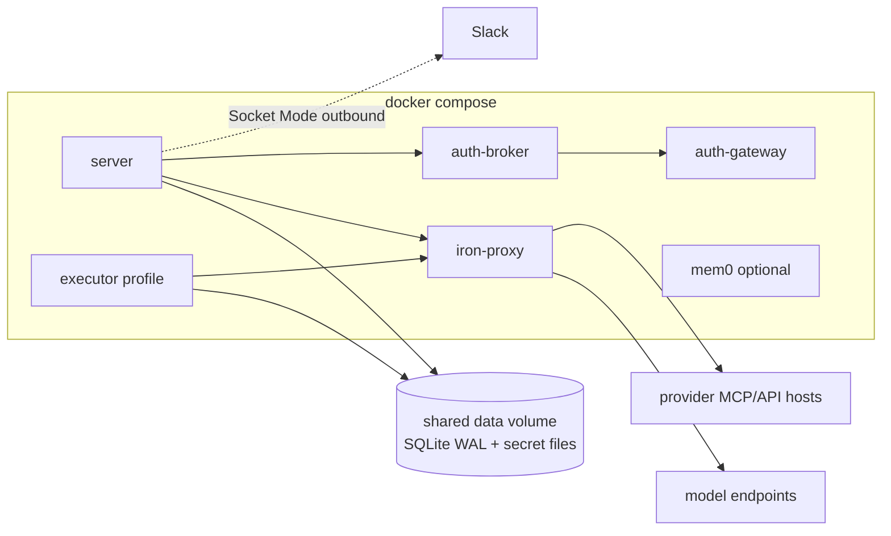

Every container resolves DNS through iron-proxy, so it is the only path out
of the compose network. The server and executor share one SQLite file with
WAL and `busy_timeout`, migrated idempotently at boot.

## Egress: the iron-proxy boundary

Outbound traffic passes allowlist, judge, static-secret injection, and optional
OAuth-token minting. The judge runs **before** credentials are attached, so
the policy LLM never sees real values.

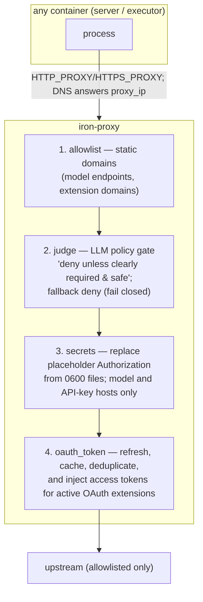

The deployment currently runs one shared iron-proxy instance, so its native
OAuth single-flight coordination serializes refreshes across every server,
worker, and session. A separate `iron-token-broker` is only required when the
deployment adds multiple proxy instances; the current single-host topology
explicitly keeps that as its scaling ceiling.

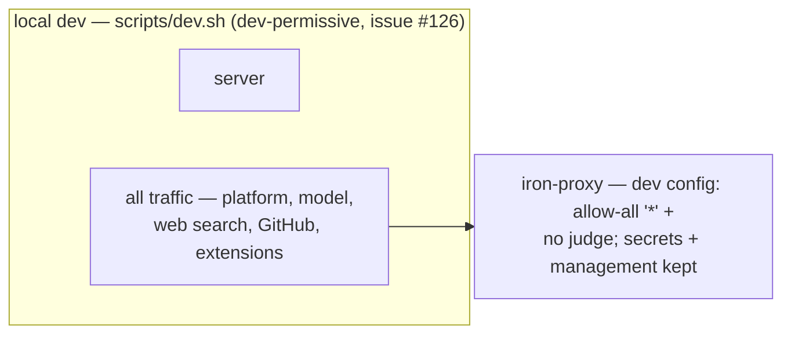

**Dev vs deployment egress (#123 → #126).** `ec580a4` made iron-proxy
default-on for local dev: the egress config is reloaded before the server
boots (`POST /v1/reload` on the management API). The strict config's judge
rules denied the server's own model calls (a context-free LLM denies bare
model/API requests) and Slack domains weren't allowlisted at all, which
broke the bot under the dev proxy. Instead of loosening the deployment
contract, local dev now loads the generated **dev-permissive config**
(`config/egress.dev.yml`: allow-all allowlist `"*"` + no judge; model-gateway
secrets, request-scoped extension authorization markers, and management paths
retained; mounted only by `docker-compose.dev.yml`) — so ALL dev traffic passes
the proxy while the credential boundary stays identical.
temporary #126 `NO_PROXY` bypass in `scripts/dev.sh` is reverted (the dev
proxy passes everything; routing through it is harmless). `NEARAI_JUDGE_API_KEY`
is a deployment concern only. The compose topology above still routes
everything through the strict config/egress.yml, unchanged.

### Local development topology (#123/#143/#311)

`scripts/dev.sh` is a thin path/canonical-worktree launcher. Both `bun run
setup` and `bun run dev` delegate decisions to `scripts/dev-bootstrap.ts`.
The TypeScript bootstrap owns no ambient side effects: command, filesystem,
clock, and readiness operations enter through explicit ports.

The bootstrap has two separate phases:

1. Setup check/plan reads declared state and readiness only. It performs no
   writes or service starts. Explicit `--apply` validates Docker, Compose,
   Bun's native SQLite binding, file owner/mode/type, templates, and any
   existing CA pair before the first mutation.
2. Apply seeds only missing OMP defaults, generates the shared CA under a
   lock, creates the mode-0600 proxy token, and starts the existing proxy and
   broker topology. Proxy readiness is the authenticated config reload. A
   401 permits one force-recreate recovery. Broker readiness is conjunctive:
   health plus the owned mode-0600 token. The private-image miss takes the
   existing HOME-relative local CLI fallback.

Development start is mutation-free. It reports the full missing
prerequisite plan and exits before the server unless setup is complete. Once
ready, it exports `HTTP_PROXY`/`HTTPS_PROXY`, internal-only `NO_PROXY`, the
shared CA paths, `BOTTEGA_PROXY_CONTROL_URL`/token, and
`OMP_AUTH_BROKER_URL`/token, then runs the server. `dev:watch` changes only
the final `--watch` argument.

User credentials never become setup defaults or output. Provisioning keeps
the existing `connect_upload_link` browser-to-vault boundary, and the
existing `first_run_wizard` remains the single guided credential checklist.

The broker fallback does not remove the Docker requirement: local
iron-proxy still runs in Compose. Deployment keeps the base
`docker-compose.yml`, strict `config/egress.yml`, internal service names,
and unpublished management/vault ports.

`AGENTS.md` carries the development-side safety rules for this topology:
only one dev server may use a Slack app token at a time; implementation work
is delegated to isolated task agents rather than the coordinating agent;
and every chat-discovered bug ships with a hermetic regression test. These
are workflow controls, not runtime enforcement.

## Agent driver abstraction (agents are pluggable)

The agent is **not** hardwired to OMP. Everything that talks to an agent —
the space service, the executor — depends only on the `AgentDriver` /
`AgentSessionDriver` interfaces in `src/server/drivers/agent-driver.ts`:

```ts
interface AgentSessionDriver {
  prompt(text, opts?: { streamingBehavior?: "steer" | "followUp" }): Promise<void>;
  abort(): Promise<void>;
  isStreaming(): boolean;
  on(event: "message" | "turn_start" | "turn_end" | "error", cb): () => void;
  dispose(): Promise<void>;
  setModelRole?(role: "default" | "fast" | "reasoning"): Promise<...>; // optional (issue #64)
}
interface AgentDriver {
  createSession({ spaceId, transcriptDir, onOutput, cwd?, allowTools? }): Promise<AgentSessionDriver>;
}
```

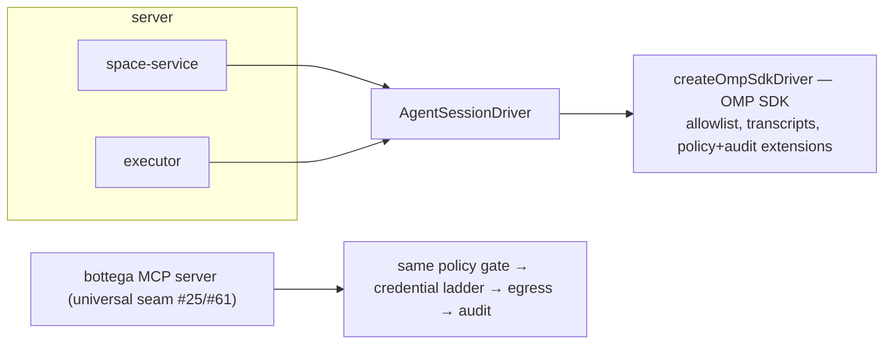

- **`createOmpSdkDriver`** (default) wraps the OMP SDK. It owns all
  OMP-specific wiring: the space-agent tool allowlist (conversation/read-only
  tools + `task` + `create_work_item`/`work_item_cancel`; **no** bash/write
  on the space agent), file-backed transcripts
  (`data/sessions/<space-id>.jsonl`), a private agent registry per session,
  and the policy + audit extensions.
- The bottega MCP server (`src/mcp/server.ts`) is the **universal agent
  seam** (issues #25/#61): memory (memory.save/search), the connect
  capability (connect_extension), and every registered extension's manifest
  tools — executed server-side through the same policy gate → credential
  ladder → egress boundary → audit spine as in-session OMP tool calls, so
  any surface gets identical enforcement. Its env contract is set by the
  process that spawns it (BOTTEGA_SPACE_ID plus the two path vars).
- `setModelRole` (issue #64) is an optional `AgentSessionDriver` hook: the
  OMP driver implements it via the SDK's `setModel`/`setThinkingLevel`; a
  driver without it reports not-supported and `use_model` surfaces that as
  an error instead of pretending to switch.

**Driver conformance (#173).** One suite,
`src/server/drivers/driver-conformance.test.ts`, runs against the OMP
driver.
Every session option must be honored or rejected as unsupported; nothing may
be silently dropped. OMP honors tool narrowing; a driver without a narrowing
field would throw for `allowTools` requests narrower than the standard space
surface rather than silently drop them.

### Model resolution is catalog-backed and turn-aware (#78/#80/#185/#189/#192/#194)

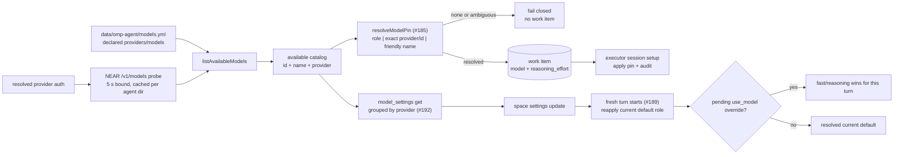

The agent directory is installed before OMP sessions start. Server and
executor run `ensureAgentDirModelPin`, and `assertAgentDirModelAvailable`
stops boot with the actual directory/config/auth cause when no declared
provider is usable (#80). Operator-owned `modelRoles` blocks are not
overwritten.

`src/models/model-pin.ts` merges the declared catalog with a bounded NEAR
gateway probe (#194). A qualified `provider/id` is explicit. Friendly names
match case-insensitively over ids, display names, and provider-qualified ids;
no match or an unresolved tie is an error. When providers tie at the best
unqualified match, one NEAR candidate wins.

Work-item pins override space model settings only for that worker session
and record the applied model/effort (#185). For conversations,
`OmpSessionDriver.reapplyDefaultModelRole` reads current settings before
each fresh turn, so a settings change reaches an already-live session
(#189); a pending `use_model` override remains one-turn intent.

Provider failures represented by the SDK as empty assistant messages are
also surfaced: `OmpSessionDriver` preserves the provider/session cause
through `turn_end`, and `SpaceService` includes it in retry/churn text.

## Policy & approvals (internals)

`src/policy/` implements the gate. The user-facing view (buttons, response
mode, extension policy config) is in
[features.md](features.md#policy--approvals-user-facing).

1. **Tier** comes from the tool declaration (read / write / exec); unknown
   tools are treated as exec, and unknown *names* always deny.
2. **Policy** = org floor (`config.yml`, fail-closed when absent: everything
   denies) + space overlay (`spaces.policy_json`, can only tighten). Strict
   YAML-subset parsing; any structural error fails the policy closed.
3. **Decision precedence** (issue #45): explicit tool `deny`/`prompt` wins →
   `approvals.always_approve` contains the tool → allow → tier logic
   (`prompt` and `exec` tier → `ask-human`; read/write + allow → allow).
   Exec never fails open.

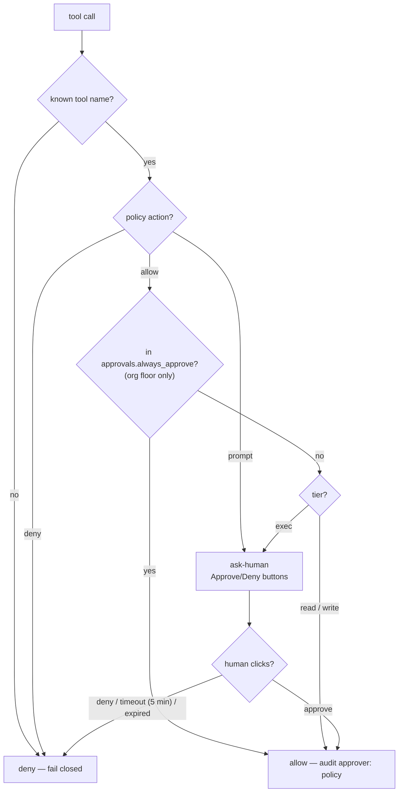

| Condition | Decision |
| --- | --- |
| Tool has explicit `deny` policy (org floor or space overlay) | deny |
| Tool has explicit `prompt` policy | ask-human |
| Tool in `approvals.always_approve` (org floor only) | allow |
| read/write tier, policy action `allow` | allow |
| exec tier, policy action `allow` (no always_approve) | ask-human |
| Unknown tool name | deny |
| Policy parse/structural error (YAML subset, unknown extension ids) | deny |
| ask-human timeout (`approvals.timeout_minutes`, default 5 min) | deny (prompt rewritten to expired) |
| Headless context (executor, headless MCP) | deny (`DenyRouter` — every ask-human request denies) |

4. **ask-human** posts an interactive Approve/Deny prompt to the space
   channel (Slack block actions `bottega_approve` / `bottega_deny`, issue
   #44) and resolves when a human clicks; the message is rewritten with the
   outcome. Headless contexts use `DenyRouter` — no approval channel there.
5. **`approvals.always_approve`** (org floor only; default off) lists
   exec-tier tools that skip the ask-human prompt when their policy action
   is `allow` — the space overlay can only *remove* entries, never add.
   Auto-approvals audit `approval.resolved` with `approver: "policy"`.
6. **Every decision** is audited (`policy.decision` with tool/tier/decision/
   reason; args redacted), and every ask-human round-trip additionally
   writes `approval.requested` / `approval.resolved` (approver = the Slack
   user who clicked).

**Settings escalation (#151).** The `settings` tool's org-scope write path
crosses the synthetic exec-tier `settings_org_write` action through the same
router. Space-scope settings accept only `response_mode`, `extensions`, and
`proactive`, and effective-policy merging clamps them to the org floor;
`always_approve` can only become stricter. Headless org writes deny.

**Executor sessions** run with `preApproved: true` policy scope: the work
item's pickup approval (the human-approved `create_work_item` call in the
channel) **is** the authorization. Allowlisted exec tools are then permitted
inside the workspace, while unknown tools still deny and explicit
deny/prompt policies are never bypassed.

**Response mode** mechanics (issue #55; user-facing behavior in features.md):
the org floor sets it in `config.yml`; the space overlay (`spaces.policy_json`)
may change it but can only tighten (`always` → `mention` → `request-only`) —
a looser overlay value is clamped to the org floor, mirroring the tools rule.

**Extension policy** mechanics (issue #56): `extensions.allow`/`deny` take
registered extension ids; empty lists mean no restriction (the registry is
the base allowlist); unknown ids in either list are a structural error — the
policy fails closed. The space overlay can only tighten: `allow` lists ids
to *remove* from the org floor, `deny` lists ids to *add*, and
`org_credentials` clamps like response mode (`allow` → `deny`, never back).
Extension tool calls resolve against the allowlist **before** tier and
approval logic — a denied extension is denied outright (with reason + audit)
and never reaches credential resolution. `org_credentials: deny` makes the
credential ladder's `auto` scope skip org credentials.

## Skills (issues #234/#235, #314, #87)

Skills are durable procedures a session can load on demand through
`skill://<name>`. Each skill directory contains one `SKILL.md` plus its
declared companion files. `SKILL.md` frontmatter must name the directory and
provide the non-empty description used to claim the skill.

**Tiers and reads.** Built-ins ship read-only at `skills/`
(`BOTTEGA_BUILTIN_SKILLS_DIR` overrides). Per-space skills live at
`<BOTTEGA_SKILLS_DIR>/<spaceId>/<name>/` (default `data/skills`). The
effective order is space then built-in, first name wins. `list_space_skills`
and `get_space_skill` report the effective source tier, content revision,
companion names, and any lower built-in shadowed by the space version. Only
`get_space_skill` returns the bounded document and companion bodies.

**Lifecycle boundary.** `create_space_skill`, `update_space_skill`, and
`delete_space_skill` mutate only the selected space tier. Create refuses an
existing name. Update replaces `SKILL.md` and the complete declared
companion set and requires the current SHA-256 content revision. Delete also
requires that revision and cannot delete a built-in. A stale revision,
invalid document/path, symlink, cap violation, or filesystem failure leaves
the prior tree unchanged. Writes stage beside the destination and roll back
the directory swap on failure. Successful writes record a small internal
manifest so later reads reject undeclared, missing, or modified files.

Companion paths are relative POSIX paths only. Absolute paths, backslashes,
empty/dot/hidden/traversal segments, reserved `SKILL.md` or metadata names,
more than 8 path segments, and paths over 240 UTF-8 bytes are rejected at
both the tool schema and filesystem boundary. The fixed content limits are:

- `SKILL.md`: 64 KiB.
- One companion file: 256 KiB.
- Companion count: 32.
- Whole skill document plus companion bytes: 1 MiB.

No read or mutation follows a symlink or resolves outside the configured
space root. Audit rows contain names, revisions, file names, sizes, and
SHA-256 hashes, never document or companion bodies. Slack mutation approval
cards use the same hash-and-size replacement summary.

**Injection and refresh.** Both session creators resolve skills and pass an
immutable snapshot to `AgentDriver.createSession(opts.skills)`:

- `SpaceService.#createLive` resolves the space tier.
- The executor resolves `WorkItem.skills` against space then built-ins.
- A git-delivery item with no explicit pins receives built-in `pr_review`;
  extension items receive none. Unknown pins are skip-logged.

The OMP driver forwards the snapshot to `createAgentSession`, which resolves
`skill://` within each skill directory. Successful create, update, and
delete operations invalidate only the per-space loader cache. A running
session keeps its original snapshot. The next cold-started space or
work-item session deterministically sees the new version, or the revealed
built-in after delete. Built-ins remain cached once per process.

List/get are read-tier. Create/update/delete are exec-tier and therefore
need both a `tools:` allow entry and `approvals.always_approve` membership
to skip human approval (see setup.md).

## Extension runtime: the safety spine

`src/extensions/` implements the registry (issue #50): pinned provenance,
manifest/binding, credential schema, effective tool surface, and policy. The
user-facing view is in
[features.md](features.md#extensions--the-registry).

1. **Manifest and snapshot** — `manifest.ts` validates ids, bindings,
   `credentialSchema`, reachability `domains`, reviewed `credentialTargets`,
   and optional tools. A target names the exact host and an optional
   segment-boundary path prefix that may receive a credential; a broader
   egress domain grants reachability only. Missing, malformed, or unbound
   targets fail closed. A top-level `config/extensions/<id>.json` snapshot
   must carry reviewed provenance; drafts live under
   `config/extensions/drafts/`, outside the registry scan. Invalid or
   unreviewed snapshots never partially register.
2. **Chat-native draft/review/pin** — `catalog_browser` in
   `src/tools/admin.ts` creates the unreviewed catalog draft, instructs the
   agent to use `web_search` for the vendor-official binding (#146), and
   requires a second `confirm: true` pin call after showing the completed
   summary (#195). Confirmation is the review. The tool reuses
   `pinSnapshotDraft` in `src/extensions/fetch-catalog.ts`, writes the
   snapshot, and regenerates both `config/egress.yml` and
   `config/egress.dev.yml`; the binding host joins the domain set. Hosted
   streamable-HTTP + OAuth is preferred. A stdio/CLI binding requires both
   `no_hosted_variant: true` and human confirmation.
2b. **Connect registers at runtime** — issue #232/#233: when `connect <X>`
   names an UNREGISTERED hosted-MCP id, `connectExtension` (with the
   `catalogRegister` seam wired) runs the deterministic route in
   `src/extensions/catalog-register.ts` — catalog lookup (semantic:
   exact id OR name/alias — issue #233) → draft (the official
   `mcp.<vendor-domain>` endpoint derived from the catalog record + the
   vendor's RFC 8414 OAuth metadata; OAuth-gated servers register
   tools-less, the #231 notion shape) → the connect's OWN approval covers
   org scope (the `register_extension` gate is REMOVED from this path; the
   `connect_extension` approval payload carries the draft facts — vendor,
   domains, MCP endpoint — so the egress-add step rides it; a denied
   connect registers NOTHING; personal connects are direct) → REGISTER AT
   RUNTIME: the manifest persists to the store-backed runtime registry
   (`extension_registry` — machine state, never a repo file; boot merges
   pins + the persisted runtime set into the live registry,
   `src/extensions/runtime-registry.ts`), the egress configs regenerate
   with the merged runtime set (byte-pinned for the seed fixtures), the
   snapshot hot-registers into the live registry (the canary's
   extension-pin journey mechanics, #197), and the proxy reloads → the
   connect continues in the same turn (OAuth mint #198 / upload link
   #196). Unknown ids fail loudly with the catalog browse path; the
   routing is deterministic — the model is never the driver.
3. **Effective tools** — `tools` is optional (#158). Present tools,
   including `[]`, are the reviewed pinned surface. An absent MCP surface
   comes from paginated provider `tools/list`. `generate-tools.ts` can pin
   that surface (#157): model-facing names are namespaced, `providerName`
   preserves the wire name (#148), read/destructive hints and verbs select
   read/exec, and everything else defaults to write for review.
4. **Lazy failure** — `surface.ts` resolves providers at boot, caches
   successes per binding, and never caches failures (#166/#167). A failed
   provider is skipped with evidence so boot continues; session creation
   and per-call ownership resolution retry it. If it remains unavailable,
   the call fails as "tool surface unavailable" rather than running with an
   empty or stale subset.
5. **One execution with one principal** — the SDK definition in `tools.ts`
   binds the caller from the current turn (#152), maps the provider wire
   name once, and calls `ExtensionRuntime.execute` once (#178). The manifest
   name remains the policy/audit identity. Another human steering the live
   turn cannot replace the principal that began it.
6. **One runtime spine** — `runtime.ts` resolves policy before credentials,
   then the org/me/auto ladder, the credential boundary, the provider call,
   and `extension.call` audit. Denied calls never touch the resolver.
   Provider `isError` results remain errors. `src/mcp/server.ts` exposes the
   same runtime to any MCP client / future agent surfaces, with `DenyRouter`
   for ask-human decisions in its headless process (#61/#172).
7. **No-secrets upload path** — `connect_upload_link` is available in OMP
   sessions and, when `BOTTEGA_UPLOAD_BASE_URL` is wired, the MCP surface
   (#196) — the server sets that env to the deployment's PUBLIC base
   (resolved lazily per mint, issue #249: the durable store
   `data/public-base-url` written by `scripts/tunnel.sh` first, then the
   `BOTTEGA_OAUTH_CALLBACK_BASE_URL` override — the same public base the
   #198 OAuth callback reads) when configured, else the loopback URL of its
   in-process endpoint. `src/extensions/upload-link.ts` mints a 144-bit
   opaque token in
   SQLite, limited to five live links per actor and 15 minutes by default.
   The loopback browser endpoint atomically consumes the token, limits POST
   attempts per client IP, and invokes the existing `connectExtension` path
   so org approval, broker upload, registry metadata, and audit stay
   identical. Consumption precedes the vault write: a failed upload burns
   the link and requires a re-mint. OAuth providers have no uploadable
   secret and are refused by the mint path. The connect path rejects
   recognized credential shapes before gate/broker/audit work; this is a
   narrow guard, not a general scanner for arbitrary Slack text.
8. **Stable connection lifecycle** — `extension_credentials.id` is the
   operator target. The runtime reads only `status=active` rows. Replace
   uses revision compare-and-swap, a staged boundary activation, and
   post-switch retirement of the old vault row. Disconnect advances through
   `disconnecting_boundary` and `disconnecting_authority`; each phase is
   audited and retryable, while every non-active phase stays denied. List
   and inspect filter personal rows to the caller and expose no vault
   namespace, row ID, identity key, or token material. Org mutations cross
   `replace_connection` / `disconnect_connection` policy approval before
   state changes.

GitHub's production snapshot is the hosted streamable-HTTP endpoint
`https://api.githubcopilot.com/mcp/`; no local GitHub MCP binary is installed
(#145). Production snapshots also cover Attio and Linear (OAuth via #198);
Notion is NOT pinned (issue #233) — it registers through the runtime
registry when a connect targets it (the #231 mechanics now run on the
store-backed path).

```mermaid
sequenceDiagram
    participant T as tool bridge
    participant P as policy gate
    participant L as credential ladder
    participant R as configured resolver
    participant B as credential boundary
    participant X as iron-proxy
    participant H as hosted provider MCP
    participant A as append-only audit

    T->>P: manifest tool + turn principal + space
    P->>P: extension allowlist + tier
    alt denied / unknown
        P->>A: policy.decision + extension.call(deny)
    else allowed
        P->>L: resolve me / org / auto
        L->>R: credential metadata only
        alt secrets_backend = omp-broker
            R->>R: broker snapshot; OAuth refresh stays in broker
        else secrets_backend = 1password-connect
            R->>R: provider:identityKey → vault/item/field
        end
        R-->>B: secret payload
        B->>X: random per-call placeholder + distinct mode-0600 file
        B->>X: exact reviewed host/path rules + POST /v1/reload
        T->>X: placeholder-bearing streamable-HTTP request
        X->>X: allowlist → judge → target-bound placeholder replacement
        X->>H: credentialed tools/call<br/>providerName wire value
        H-->>T: one result (isError preserved)
        B->>X: delete file + remove rule + POST /v1/reload
        T->>A: extension.call {tool, actor, credential_id, decision, call_id}
    end
```

Missing backend configuration, credential row/mapping, reviewed target,
supported secret shape, config marker, or proxy reload stops the request
before it can run unauthenticated. Completion, error, timeout, and cancellation
delete the call's secret before removing its rule. A cleanup reload failure
therefore leaves the old rule unable to resolve authority. Startup clears the
scoped region and stale files before admitting a new call. The agent
environment, transcript, approval payload, and audit never receive the secret.

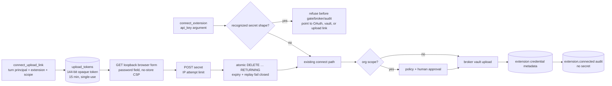

The endpoint binds `127.0.0.1` only — it never exposes the form to the
network; a deployment serving remote Slack participants supplies routing
outside this repository (a reverse proxy / tunnel in front of the host).
The mint's public base resolves lazily per mint (issue #249): the durable
store `data/public-base-url` — kept current by `scripts/tunnel.sh` (the
cloudflared quick-tunnel companion) — first, then
`BOTTEGA_OAUTH_CALLBACK_BASE_URL` as a deployment-only override for a FIXED
host. The SAME public base the #198 OAuth callback reads — ONE ingress
serves both `/upload/<token>` and `/oauth/callback`. A quick tunnel that
rotates self-heals: the script writes the new URL to the store and the next
mint uses it, no `.env` edit and no server restart. When a base resolves,
the mint returns `<base>/upload/<token>` instead of the loopback URL, so a
browser on a remote host reaches the form through the ingress. Unset →
local dev: the
mint returns the loopback URL of the in-process endpoint. Static tunnels
pin the listener with `BOTTEGA_CALLBACK_PORT` (default 0 = ephemeral): ONE
Bun.serve serves `/upload/*`, `/oauth/callback`, and the webhook route on
that single stable port. A standalone MCP process without
`BOTTEGA_UPLOAD_BASE_URL` does not advertise the mint tool. A raw secret
already typed into an arbitrary Slack message is outside this typed-boundary
guard.

### CLI surface (thick tools image + spawn path)

`kind: "cli"` extensions run curated, preinstalled CLIs — zero client code,
no SDK. Three pieces (issues #58, #62, #63):

1. **Tools image** (`Dockerfile.tools`) — oven/bun:1 plus the curated CLI
   set v1.1 (the full list and the heavy/optional layer are in
   [features.md](features.md#extensions--the-registry)). NO credentials are
   baked in, ever. The app image (`Dockerfile`) builds **FROM** the tools
   image (issue #62), so the single `bottega:${BOTTEGA_IMAGE_TAG}` image —
   used by BOTH the server and the executor entrypoints — carries the
   CLIs live on PATH in the executor container; build the tools image
   first (`docker build -f Dockerfile.tools -t bottega-tools:ci .`). The
   tools image is built in the CI **docker** job (not the fast
   check/test job) so the default CI stays under 5 minutes, and locally
   for extension development. Push/pull of a cached build from a registry
   is a deploy concern, not this job's.
2. **Spawn path** (`src/extensions/tools.ts`) — a cli tool executes the
   manifest's binary with the manifest's fixed `args` first, then the
   call's params as `--name value` flags (`--name` alone for boolean
   true). The child env is the parent env minus credential-named variables
   (`CREDENTIAL_ENV_RE` in `manifest.ts`), plus the manifest's
   credential-free `env` delta — a manifest that declares a credential in
   `cli.env` is rejected (fail closed).
3. **Per-org CLI extension** — an org that needs a CLI outside the curated
   set extends the image itself, never the default: append to
   `Dockerfile.tools` in the org's fork (keeping the curated baseline
   intact), or mount a local layer at deploy time (a one-line
   `FROM bottega-tools:latest` image with the org's packages, or a volume
   with static binaries). The curated set stays the baseline by design.

**Credentials never travel via env.** Auth for CLI tools happens at the
iron-proxy boundary: the executor points `HTTPS_PROXY` at iron-proxy, the
egress allowlist (`src/egress`) gates which domains are reachable, and the
proxy injects the credential for the allowlisted domain at request time.
Per-request credential selection (caller/scope → credential id) is the
runtime's concern (issue #53); this surface delivers the spawn path and
the no-credential-in-env guarantee. gRPC-heavy CLIs (gcloud, kubectl — both
in the opt-in heavy layer above) do not fit the HTTP-proxy boundary and
get partial support (documented limitation): they can run for
non-authenticated operations, but credentialed gRPC calls are not
supported.

## Memory producer and maintenance contract (#155/#321)

`MemoryProvider` (`src/memory/types.ts`) is the production boundary for
validated saves, scoped searches, exact metadata filters, capability
reporting, and derived-digest retention. Providers expose no general update
or delete method. Callers must not inspect a backend name or reach into its
storage to perform maintenance.

The current producers and their persisted metadata are:

| Producer | Scope/content | Metadata contract | Maintenance owner |
| --- | --- | --- | --- |
| Manual `memory.save` | Derived writable scope; caller text | Caller metadata; no reserved `kind` | None |
| Auto extraction | Person or channel scope; human-stated facts only | `source=auto_extract` | None |
| Idle digest | Org summary of one space transcript interval | `kind=digest`, `space`, `since`, `until` | Provider digest cap |
| Standup digest | Org summary of work-item state | `kind=digest`, `space`, `since`, `until` | Provider digest cap |
| Daily reflection | Org deterministic activity fact | `kind=reflection`, `space`, `date`, `topic` | None |
| KB ingestion | Org source chunk | `kind=kb`, `source=<source id>`, `url` | None; refresh appends |
| SQLite consolidation | Org/person compacted fact | `source=consolidation`, `consolidated=1` | Scheduled explicit compactor |

The org-pulse observer is not a producer. It performs metadata-only reads of
digest and reflection rows and posts a report. Every provider must preserve
metadata values and exact-match filtering because these producer tags are
the stable search seam.

#163 owns the atomic move to normalized provenance. Its required logical
shape is `producer`, `space`, `ts`, and `source_ref`, with an absent field
when it does not apply. That change must migrate every producer together and
extend both provider conformance legs; mixed producer-specific and normalized
shapes are not a supported end state. #155 does not add correction,
redaction, tombstones, or a user-facing forget operation.

Maintenance capabilities are explicit:

- SQLite reports `consolidation=explicit` and
  `digestPruning=explicit`. The worker runs consolidation across each org and
  person pool after the new-fact threshold. The model may request strict
  `ADD`, `UPDATE`, or `DELETE` actions against the numbered active pool;
  malformed or out-of-range actions are ignored, and a compaction marker
  prevents replay. Digest pruning removes only derived `kind=digest` rows
  older than the newest per-space cap.
- mem0 reports `consolidation=on-save` because its add operation maintains
  the active set and provider history. It reports
  `digestPruning=unsupported`; a digest producer must reject before its model
  call, post, or save rather than silently leaving an uncapped digest.

Retention is not a general deletion authority. Saves append. KB, reflection,
auto-extracted, and manual content is outside the digest pruner. Digest
pruning is the narrow exception for replaceable summaries whose source
transcript remains durable. Consolidation changes only the active fact pool
under its declared mode. Human correction/deletion remains unavailable until
the tombstone contract in #163.

The shared provider conformance suite uses a temporary SQLite database and a
hermetic mem0 HTTP double. It drives representative save/search metadata,
the declared consolidation mode, digest pruning or its loud rejection, and
the absence of general update/delete paths. Caller tests also prove idle and
standup digest producers check pruning capability before side effects.

## Scheduler: durable cron (epic #111)

`src/scheduler/` implements a durable, UTC-only scheduler with policy-gated
lifecycle tools (issues #86 and #308) and typed built-in actions for
standups, reflection, org pulse, governance digest, recurring work, messages, and ingestion.

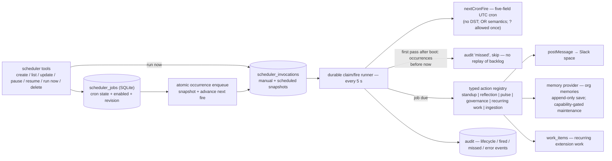

- **Boot skip policy, not catch-up** — on the first successful tick after
  boot, every occurrence strictly before boot time is audited as `missed`
  and the job advances to its next future occurrence. The runner never
  replays a backlog after downtime.
- **No overlap** — scheduler passes never run concurrently (single tick
  runner, non-overlapping), so a slow action can't double-fire.
- **Linearized lifecycle** — expected revisions reject lost updates.
  Pause blocks future occurrence claims; resume computes from its own time.
  A claimed execution keeps its snapshot while a concurrent edit changes
  only future executions. Run-now uses the same durable invocation claim and
  fire path and never advances recurring state.
- **Fail closed** — jobs and actions resolve through the same policy,
  memory, and audit spines as everything else; a firing job with invalid
  params is audited as an error, not silently dropped.
- **Opt-in per space** — humans enable standups/reflection in
  `spaces.policy_json` with `proactive: { standup: true, reflection: true }`;
  invalid policy data fails closed (disabled). The org pulse targets a
  configured Slack space.

The weekly `governance_digest` is model-free and opt-in at its destination
space. It reads cursor-paged audit summaries through the canonical allowlist,
groups approvals/denials/timeouts/credential scopes/settings changes, and
posts once. Delivery failure is redacted and audited inside the action.

## Knowledge-base ingestion (#91)

Knowledge-base ingestion is an explicit write path, not a scheduler action.
`config/kb.yml` declares unique HTTP(S) document sources without embedded
credentials. `kb_ingest` in `src/tools/kb-tools.ts` refreshes either one
source id or all sources in declaration order; it is a write-tier
space-agent tool and its source host must still pass the active egress
policy.

`src/kb/ingest.ts` is deterministic and model-free:

1. Fetch with a 10-second timeout and 5 MiB response cap.
2. Convert HTML structure to text when needed, then split on Markdown
   headings and paragraph boundaries. Headed chunks repeat the heading and
   stay at or below 2,000 characters.
3. Append every chunk to shared org memory with
   `{ kind: "kb", source, url }` metadata.
4. Append one redacted `memory.write` audit row per saved chunk, recording
   the memory id and content hash rather than the chunk text.

Refreshes are append-only; the pipeline does not delete or replace earlier
memories. The same functions back manual one-source and all-source runs, so
there is no model-dependent summarization branch.

## Proactive onboarding (#116)

The first-run checks have one implementation, `runWizardChecks` in
`src/tools/admin.ts`, shared by the `first_run_wizard` tool, boot, and
in-conversation recovery:

- At boot, `src/server/index.ts` reads the org setting
  `onboarding.space_id`. If any checks fail, it posts one guided message to
  that space for that boot and audits `admin.onboarding_boot`. No configured
  space means no post. A Slack posting failure is logged and audited but
  does not prevent the server from booting.
- During a conversation, `SpaceService` appends the same guidance when a
  session error or repeated-empty-completion churn meets failing checks.
  The nudge is deduplicated per space and failing-check set, not per
  message. A changed failure set can nudge again; successful checks clear
  the record so a later regression is visible. Check failures suppress only
  the nudge, never the underlying error reply.

## Slack responsiveness and turn delivery (#119/#120/#179/#180/#181/#184/#193)

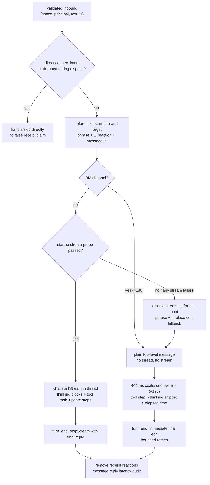

`SpaceService` starts receipt work before attachment ingestion or session
creation. Phrase and reaction failures are logged but never block the turn;
audit payloads contain the Slack timestamp, not message text (#119).

DMs always instantiate `SlackTurnPresenter`, whose `replyOpts()` returns no
thread. Channels use `StreamTurnPresenter` only when the adapter's bounded
probe says streaming is available. The stream client has retries disabled
and a ten-second call bound; any failure flips the per-boot capability flag
and the presenter falls back to the plain path (#181). The hermetic e2e
harness uses the explicit `streamingSupported: () => false` seam to exercise
that fallback (#179). `agent_view` and `assistant:write` remain absent from
the Slack manifest because they hid DM messages (#184).

The admin-only App Home handler publishes a deterministic, revision-hashed
Block Kit view from canonical read models. Workspace admin status comes from
Slack `users.info`; unknown or non-admin viewers fail closed. Each section
has its own error boundary, personal connections are owner-filtered, and
repeated unchanged events do not republish or repeat the read audit.

On the plain path, progress prefers the current gated tool step, then the
latest model thinking snippet, then `Thinking… Ns` (#193). Reply/progress
updates coalesce at `STREAM_UPDATE_INTERVAL_MS = 400`; `turn_end` flushes
the latest final text immediately and retries final delivery up to the
bounded limit (#120).

## Data flow: "issue shared in Slack gets implemented"

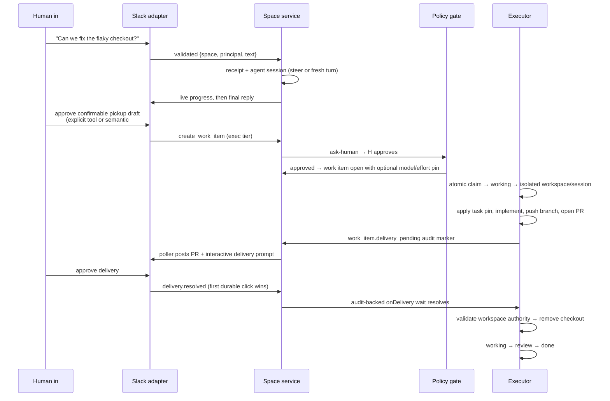

## Git workspace authority boundary (#310)

`src/worker/workspace-lifecycle.ts` is the only executor component allowed to
replace or remove a Git workspace. The directory name alone grants no
authority. The component resolves the configured root and target, requires
the target to be a canonical direct child, rejects symlinks and path escape,
and validates `.git/bottega-workspace.json` against the same work-item ID and
repository. The marker also carries a versioned Bottega owner and unique
creation identity, but never a credential.

An agent, Git, delivery, or approval failure leaves the marker and checkout
intact. Retry can replace only that exact marker-matched checkout. Approved
delivery validates and removes it while the item is still `working`; an
uncertain cleanup therefore blocks instead of becoming `done`. The explicit
operator purge first requires database authority for a `blocked` item, then
uses the same filesystem authority check and writes `workspace.purge`
decision/result audit rows. Nothing scans or deletes unknown directories,
and there is no automatic age-based purge.

## Worker isolation boundary (epic #170, #101, #105)

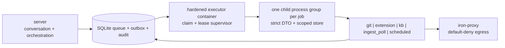

Every durable worker kind crosses the same mandatory child boundary. The
executor serializes one strict, bounded, non-secret job request. The child
reopens only the configured SQLite file, derives the job scope from that
envelope, and writes lifecycle, outbox, and audit rows through the scoped
store facade. There is no production in-process fallback. Missing launcher
wiring, invalid IPC, an unavailable Linux resource-limit profile, a timeout,
or lease loss fails closed. Timeout and lease loss kill the complete process
group before the supervisor maps the exact child exit contract.

The child environment is an allowlist. Slack and webhook secrets, provider
keys, and proxy-management credentials are absent. The git PAT file is
mounted only for `git` jobs. The auth-broker token file is mounted only for
`extension` jobs. Other kinds receive neither credential mount. HTTP(S)
uses the executor container's iron-proxy settings; the deployment DNS and
proxy policy remain the network truth.

The current Linux deployment applies the reachable #105 controls at the
executor-container boundary: read-only image root, writable durable data and
disposable workspace mounts, all capabilities dropped, no-new-privileges,
Docker's default seccomp profile, bounded PIDs/memory, and an init reaper.
Each child also uses `prlimit` for address-space, descriptor, process-count,
and wall-clock caps; missing `prlimit` refuses work.

One OS-level leg remains deployment-gated: child processes share the
executor container's network namespace and seccomp profile. A distinct
network namespace and mount table for every job requires a nested container
runtime or a host sandbox service. The deployment intentionally exposes
neither a Docker socket nor host privileges to the executor because either
would be a larger escape capability. Local non-Linux runs therefore verify
the process/IPC/teardown boundary but skip Linux resource enforcement. CI's
Docker job is the required no-skip lane for read-only root, writable
workspace, capabilities, seccomp, network isolation, resource caps, and
container teardown; the existing iron-proxy integration lane separately
proves allowed egress still works and unlisted egress remains denied.

## Persistence & audit

One SQLite file (`bun:sqlite`, WAL, busy_timeout for the server+executor
two-process share) uses the ordered registry in `src/store/migrations.ts`.
Each pending migration commits its schema/data change and `schema_migrations`
ledger row in one transaction. Boot rejects unknown or non-prefix ledger IDs
before exposing the store, and a retry resumes from the last committed ID.

- `spaces` — registry + per-space policy/model settings. First contact uses
  an idempotent upsert that never overwrites an existing overlay (#188).
- `work_items` — the queue and legal state machine below, including optional
  per-task model and reasoning-effort pins (#185). `done` requires delivery
  evidence, `blocked` requires evidence, and git `review` requires a recorded
  human approval. Stale claimed/working rows recover to `blocked`.
- `scheduler_jobs` — durable cron rows (id, action, cron, params, space id,
  next fire, last result, enabled, operator revision).
- `scheduler_invocations` — immutable-at-enqueue action snapshots for cron
  occurrences and run-now requests, with one pending/running/completed claim
  state and a caller-visible idempotency identity.
- `upload_tokens` — opaque, expiring, single-use #196 browser-upload
  grants. The MCP child and server endpoint share the table; atomic delete
  makes only the first valid POST consumable.
- `audit` — append-only; triggers reject UPDATE/DELETE. Composite
  event/space/actor + time indexes support capped newest-first cursor reads.
  Operator DTOs expose only allowlisted fields; policy decisions, approvals,
  tool calls, delivery decisions, model-pin application, and work-item
  transitions remain durable rows with payloads redacted and capped at 4 KiB.

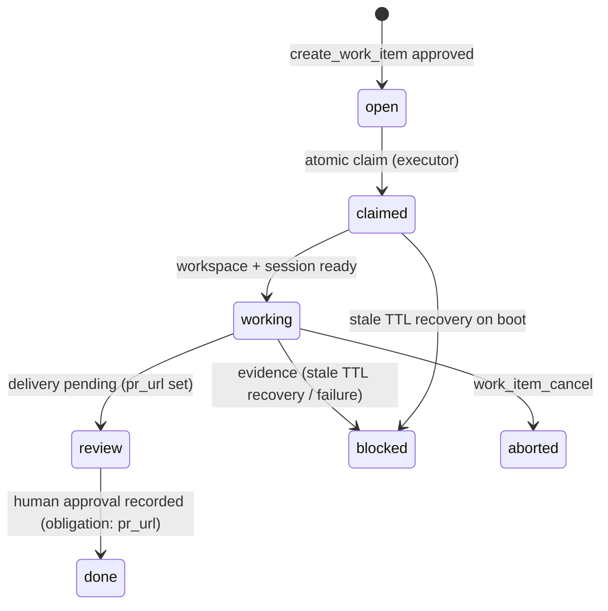

The space timeline itself is the OMP session file (`.jsonl` under
`data/sessions/`) — durable by construction, never deleted. LLM/agent data
is never deleted: "cleanup" evicts caches, never rows.

## Multiplayer & concurrency

- Many humans + one space agent: prompts during a stream **steer** (or queue
  as follow-ups); anyone can interrupt (`abort`).
- Idle spaces dispose their session (default 30 min) and cold-start on the
  next message — disposal is cache eviction, never data loss.
- Work items are independent sessions: parallel work is isolated by design.
- One process, many sessions: each session gets a private agent registry
  (OMP SDK requirement for concurrent top-level sessions).

## Safety model

| Threat surface | Control |
|---|---|
| Untrusted ingress | Adapters validate every event; only adapters mint messages |
| Credential exposure | Per-turn principal selects the credential; omp-broker or 1Password Connect resolves it; mode-0600 files and iron-proxy inject it only at the allowlisted host. API-key onboarding can use a single-use browser upload (#196). Slack tokens stay server-only; the git PAT stays file-only |
| Secret pasted into a typed connect/memory write | Recognized shapes are refused before broker/persistence/audit and redirected to OAuth, the configured vault, or `connect_upload_link`. This does not scrub arbitrary Slack text already received |
| Malicious repo content | Every job runs in a dedicated child process group and disposable workspace; the server never mounts repository paths. The hardened executor container has a read-only image root, dropped capabilities, seccomp, no-new-privileges, and bounded resources |
| Exfiltration / rogue egress | Child env and credential mounts are allowlisted; Slack/webhook/provider secrets never cross. Deployment egress remains default-deny through iron-proxy allowlist, judge, secret injection, and DNS sinkhole. Dev remains permissive by design |
| Unauthorized side effects | Policy gate on every tool call; exec and org-settings writes ask humans; unknown → deny |
| Cross-user credential confusion | The driver binds the fresh turn's principal; steers do not replace it (#152), and one tool call dispatches once (#178) |
| Data loss / tampering | Append-only audit, retained transcripts, delivery decisions as durable cross-process rows |
| Failure | Parse/policy/surface/model/secret failures deny, error, or block with evidence; streaming degrades to plain delivery |

## Verification architecture

The default Bun suite is hermetic and has grown to roughly 1,190 test cases
across the full repository wave. The exact count is not a contract; behavior
at the caller surface is. `src/server/boot-wiring.test.ts`,
`src/executor-boot.test.ts`, and
`src/server/composition-root-parity.test.ts` boot the real construction
paths in temporary directories. The driver conformance suite runs the OMP
driver. `src/executor.test.ts` drives the delivery round-trip through real
SQLite, while `src/worker/sandbox-process.test.ts` drives the production
supervisor and child entrypoint, timeout, lease-loss, bounded IPC, secret
denial, and process-tree teardown.

The definition of done is caller-level acceptance coverage (#174): drive a
real inbound message, tool call, scheduler fire, or executor claim and assert
the observable result. Helper-only coverage cannot close a feature. Criteria
that require live infrastructure become named integration legs or canary
journeys rather than silent skips.

`bun run scripts/check-coverage.ts` runs the entire suite with coverage,
parses Bun's aggregate `All files` row, and enforces an 85% floor for both
lines and functions. The wave's measured aggregate is around the low-to-mid
90s (approximately 94% in the batch snapshot); the checked-in floor, not a
transient measurement, is the merge contract. The separate gate exists
because Bun 1.3.14 applies `coverageThreshold` per file.

The highest-risk external boundaries also have explicit legs:

- `src/egress/iron-proxy.test.ts` runs the real proxy for default-deny,
  DNS-sinkhole, and header-injection behavior (#177).
- `tests/e2e/auth-broker-leg.test.ts` covers personal credential → vault
  fetch → secret file → proxy injection → hosted GitHub MCP.
- `.github/workflows/canary.yml` runs real Slack/model journeys weekly and
  fails rather than skips when CI credentials are absent (#175). It is a
  release gate, not a merge gate.
- Other real infrastructure stays `BOTTEGA_RUN_INTEGRATION=1` skip-gated
  with a concrete reason; no skipped leg is reported as passing.

## Repository layout

```
src/
  server/           index.ts (Slack composition root), bootstrap-runtime.ts (shared chain)
  server/adapters/  slack.ts, approval-router.ts, delivery-router.ts
  server/drivers/   agent-driver.ts (OMP), conformance suite
  server/services/  space-service.ts, slack-turn-presenter.ts, delivery-poller.ts
  policy/           config.ts, extension.ts, approval-router.ts, audit.ts
  extensions/       manifest/registry, discovery/generation, tool bridge, runtime/boundary, upload-link
  models/           model-pin.ts (declared + probed catalog, friendly-name resolution)
  scheduler/        cron, store, runner, actions (standup/reflection/pulse/recurring work)
  kb/               deterministic document ingestion
  store/            db.ts, schema.sql, org settings
  tools/            work items/pickup, model/settings/admin, memory/KB/object tools
  memory/           SQLite + mem0 providers behind one interface
  mcp/              server.ts (third composition root; memory/connect/extensions)
  executor.ts       second composition root + containerized claim/delivery runner
  egress/           generated allowlists + real iron-proxy leg
  secrets/          broker/gateway wiring and auth-boundary tests
  yaml-subset.ts    strict shared config parser
config/
  extensions/       reviewed snapshots; drafts/ is outside the registry scan
  egress.yml        strict generated allowlist → judge → secrets config
  egress.dev.yml    generated dev allow-all/no-judge config; secrets retained
  omp/              agent config, secrets settings, declared model catalog
  org.yml           deployment defaults (repos, git/API base)
  kb.yml            knowledge-base sources
  entrypoints/      auth-broker token bootstrap
Dockerfile              server/executor image
Dockerfile.tools        curated CLI base
Dockerfile.tools-heavy  opt-in Rust/kubectl/helm/gcloud layer
docker-compose.yml      server, executor, auth services, proxy, optional mem0
docker-compose.dev.yml  host-only dev proxy/broker ports + host data bind
scripts/dev.sh          CA/proxy boot, image-check-first broker fallback, env contract
scripts/check-coverage.ts  aggregate 85% line/function gate
tests/e2e/              skip-gated provider/proxy/broker legs + live canary
```
